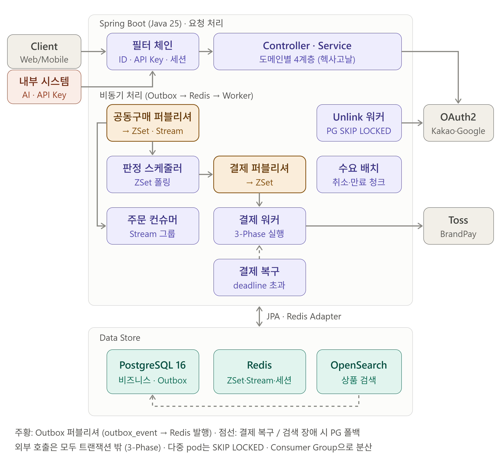
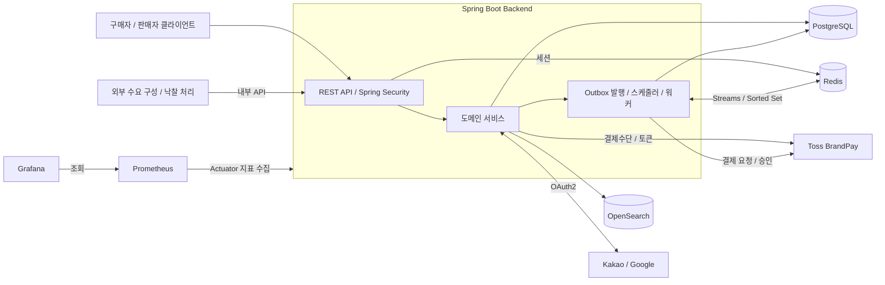
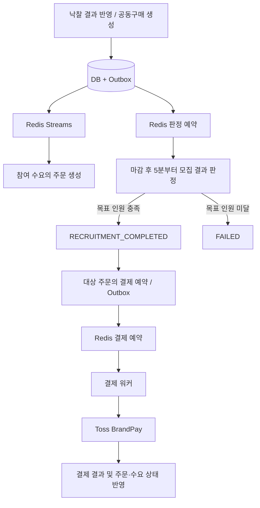
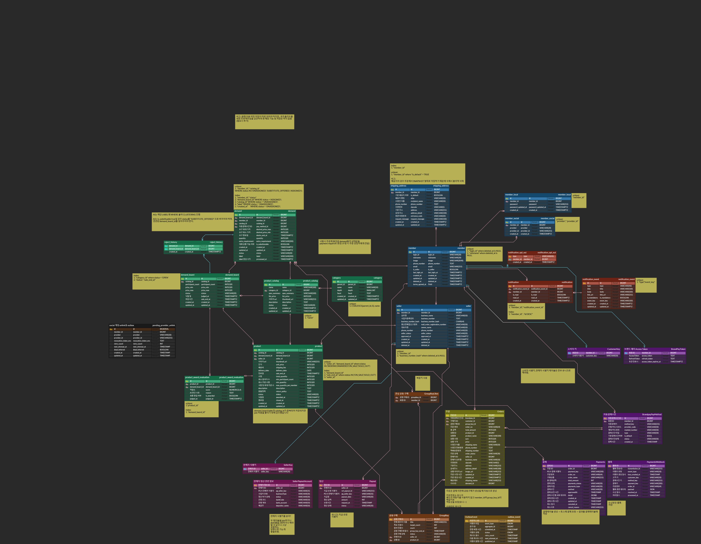
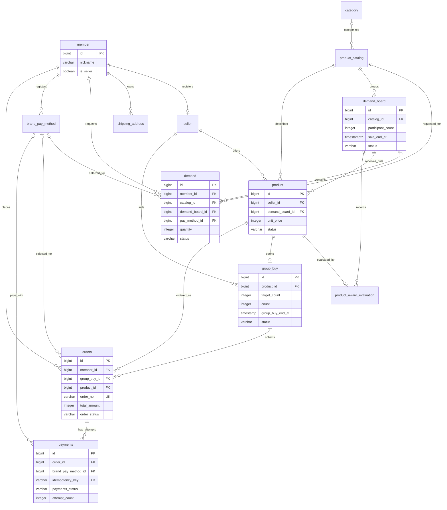

<div align="center">

# MoongCheap Backend

### "구매자의 수요를 모아 판매자의 제안과 연결하는 수요 기반 공동구매 서비스"

**개발 기간** 2026.07 ~ 2026.10 (약 3개월) &nbsp;|&nbsp; **팀** MoongCheap

</div>

<br>

## 📌 Intro

MoongCheap은 **수요 → 공동구매 → 자동결제 → 주문**을 하나의 자동화된 흐름으로 이어 붙인 백엔드입니다.
구매자는 원하는 상품·가격대·수량을 등록하고, 판매자는 모인 수요에 맞춰 조건을 제안합니다. 공동구매가 성사되면 백엔드가 자동으로 결제를 예약·실행하고 주문을 생성합니다.

- 🤝 **수요 중심 매칭** — 흩어진 소량의 수요를 수요보드(`demand_board`)에 묶어 한 번의 공동구매로 전환합니다.
- ⚙️ **자율 신경계** — 스케줄러·워커·컨슈머 9종이 사용자 요청 없이도 돌아가며 판정·주문·결제를 자동화합니다.
- 💳 **Toss BrandPay 자동결제** — 예약·실행·재시도·복구를 모두 코드로 소화하는 3-Phase 트랜잭션 분리.
- 🔍 **장애 격리형 검색** — OpenSearch가 죽어도 PostgreSQL 폴백으로 검색 UX를 유지합니다.
- 🧾 **운영 가능한 관측** — 모든 요청에 `requestId` MDC 상관관계, JSON 로그, Prometheus·Grafana 연동.

<br>

### ✨ 핵심 기능

| 기능               | 설명                                                         |
|:-----------------|:-----------------------------------------------------------|
| 🔑 **회원·인증**     | 자체 회원가입·로그인, Kakao·Google OAuth2, 소셜 계정 연동·해제, Redis 세션 관리 |
| 👤 **회원 정보·판매자** | 프로필·배송지(최대 5개 advisory lock), 판매자 등록, 공개 프로필 조회            |
| 🔎 **상품 탐색**     | 상품 도감·카테고리, OpenSearch 상품명 검색, **서킷 오픈 시 PostgreSQL 폴백**   |
| 📥 **수요 등록·매칭**  | 희망 가격대·수량·유효기간 접수, 수요보드 참여, 대체상품 제안 수락·거절                  |
| 🎯 **응찰·낙찰**     | 판매자 응찰 등록, 내부 API로 낙찰 평가 반영, 결과 조회                         |
| 🛒 **공동구매**      | 공동구매 목록·상세, 모집 마감 후 **목표 인원 충족 자동 판정**                     |
| 📦 **주문**        | **Redis Streams 기반 비동기 주문 생성**, 주문 조회, 배송지 변경·취소           |
| 💳 **결제**        | BrandPay 결제수단·토큰, **자동결제 예약·실행·누락 복구**                     |
| 🔔 **알림 설정**     | 알림 유형별 수신 설정 관리                                            |

> 수요보드 구성·대체상품 제안·낙찰 결과는 내부 API로 전달받습니다. 이 저장소는 결과를 검증하고 도메인 상태에 반영하는 백엔드이며, 외부 AI 처리 로직 자체는 포함하지
> 않습니다.

<br>

## 🛠 기술 스택

<div align="center">


</div>

<br>

| 구분                   | 기술                                                        | 용도                       |
|:---------------------|:----------------------------------------------------------|:-------------------------|
| **Language**         | Java 25                                                   | 애플리케이션 개발                |
| **Framework**        | Spring Boot 4.1.0, Spring MVC                             | REST API                 |
| **Build**            | Gradle 9.5.1                                              | 빌드·테스트, Wrapper 제공       |
| **Persistence**      | Spring Data JPA, Hibernate, PostgreSQL 16                 | 도메인 데이터 저장               |
| **Migration**        | Flyway                                                    | DB 스키마 버전 관리             |
| **Authentication**   | Spring Security, OAuth2 Client, Spring Session Data Redis | 인증·인가 및 세션               |
| **Queue / Schedule** | Redis 7, Streams, Sorted Set                              | 주문 이벤트 소비, 공동구매 판정·결제 예약 |
| **Search**           | OpenSearch 2.15.0, OpenSearch Java Client 2.11.0          | 상품 검색                    |
| **Resilience**       | Resilience4j 2.4.0                                        | 재시도·서킷 브레이커              |
| **Payment**          | Toss Payments BrandPay                                    | 결제수단 등록·자동결제 연동          |
| **API Docs**         | springdoc-openapi, Swagger UI                             | API 명세                   |
| **Observability**    | Actuator, Micrometer, Prometheus, Grafana                 | 상태·성능·처리 지연 관측           |
| **Test**             | JUnit, Mockito, Testcontainers, JaCoCo, k6                | 단위·통합·동시성·부하 테스트         |
| **CI / Delivery**    | GitHub Actions, Jenkins, Docker, Amazon ECR, GitOps       | 검증·이미지 빌드 및 배포 설정 갱신     |

<br>

## 👥 Member

|      기여자       | 담당 도메인                                                           |
|:--------------:|:-----------------------------------------------------------------|
|  **`jnj3j3`**  | 인증(로컬·OAuth2·세션), 회원·배송지, 수요·수요보드 배치, 상품 검색, 카테고리, 알림, 공통 레이어    |
| **`zzimzzim`** | 공동구매 판정, 주문 자동 생성(Streams Consumer), BrandPay 자동결제, 공통 Outbox 설계 |

> **분담의 축**
> - **`jnj3j3`** → *사용자 접점 + 데이터 소스 + 공통 인프라*. auth 쪽에는 소셜 unlink를 비동기화하기 위한 **독자 Outbox**(
    `pending_provider_unlink`)를 별도로 구현.
> - **`zzimzzim`** → *결제 체인의 End-to-End*. 공통 `OutboxEvent` 설계 + Redis Streams + Sorted Set + 3-Phase
    트랜잭션 + Toss 연동을 하나의 흐름으로 담당.

<br>

## 🏗 시스템 아키텍처

<div align="center">



</div>

도메인별 패키지로 분리된 단일 Spring Boot 애플리케이션입니다. API, 스케줄러, 이벤트 소비자, 결제 워커가 같은 애플리케이션 코드에 포함됩니다.



<br>

### 🔄 주문·판정·결제 처리

공동구매 생성 시 DB 변경과 Outbox 이벤트를 같은 트랜잭션에 기록합니다. 이후 주문 생성 이벤트는 **Redis Streams**로, 마감 판정 예약은 **Redis
Sorted Set**으로 발행됩니다.



| 항목              | 내용                                                            |
|:----------------|:--------------------------------------------------------------|
| 🧷 **중복 처리 제어** | DB 상태 조건·잠금·유니크 제약과 결제 멱등키                                    |
| ♻️ **예약 복구**    | DB에 남은 처리 대상을 확인해 유실된 Redis 예약 보완 (마감 후 65분 지난 `OPEN` 건부터)    |
| 🕒 **시간 기준**    | JVM·Hibernate는 `Asia/Seoul`, 만료 비교는 DB `CURRENT_TIMESTAMP` 기준 |
| 🔀 **결제 실행 설정** | 자동결제 큐는 기본 비활성, `PAYMENT_QUEUE_ENABLED=true`로 활성화             |

> 예약 복구의 범위와 알려진 한계는 [마감·공동구매 판정 버그 리포트](docs/troubleshooting/deadline-and-judgment-bug-report.md)에
> 정리되어 있습니다.

<br>

### 🧭 주요 처리 흐름 (Sequence Diagrams)

수요 등록부터 자동 결제까지의 전체 시퀀스는 **[`docs/flows.md`](docs/flows.md)** 에서 Mermaid 다이어그램으로 확인할 수 있습니다.

| # | 흐름              | 참여자                    |
|:-:|:----------------|:-----------------------|
| 1 | 전체 흐름 한눈에       | 수요자 · AI · 스케줄러 · Toss |
| 2 | 수요 생성과 보드 편성    | 수요자 ↔ AI               |
| 3 | 낙찰 평가           | 스케줄러 → AI → Outbox     |
| 4 | 주문 자동 생성과 자동 결제 | Redis Consumer → Toss  |

<br>

### 🚀 CI / Delivery

GitHub Actions 검증 워크플로와 Jenkins 파이프라인을 제공합니다. Jenkins는 빌드·테스트·보안 검사 후 컨테이너 이미지를 ECR에 게시하고, 별도 GitOps
저장소의 이미지 태그 갱신 PR을 처리합니다.

<br>

## 💡 설계 하이라이트

세부 설명은 **[기술적 하이라이트](docs/presentation/03-technical-highlights.md)** 에서 "문제 → 결정 → 효과" 순으로 정리했습니다.

| 패턴                                                 | 어디에 쓰이는가                                                      | 왜 이렇게 설계했는가                                      |
|:---------------------------------------------------|:--------------------------------------------------------------|:-------------------------------------------------|
| 📬 **Outbox**                                      | 공동구매·결제(`outbox_event`), 소셜 unlink(`pending_provider_unlink`) | 외부 I/O를 트랜잭션 밖으로 밀어 "외부 성공 + 내부 실패"의 복구 불가 상태 차단 |
| 🧩 **3-Phase 트랜잭션 분리**                             | `PaymentExecutionService`, `ProviderUnlinkChunkService`       | Claim · Call · Reconcile로 분해, 외부 호출 중 커넥션·락 미보유  |
| 🔓 **FOR UPDATE SKIP LOCKED**                      | Outbox 퍼블리셔, Unlink 워커, 청크 배치                                 | 다중 pod가 서로 다른 row를 잡아 **자동 부하 분산**               |
| ⏳ **Redis Sorted Set 예약 큐**                        | 공동구매 판정, 결제 실행                                                | "N분 뒤 실행"을 O(log N)으로 — Kafka 없이도 지연 큐           |
| 🚦 **Streams + Consumer Group**                    | 주문 자동 생성 (`GroupBuyOrderCreationConsumer`)                    | 자동 부하 분산 + `claimStale`로 pod 죽어도 pending 인수 인계   |
| ☠️ **Poison Message 즉시 격리**                        | 주문 생성 컨슈머 스키마 위반 메시지                                          | 재처리 가능/불가능 실패를 코드에서 명시 구분 → head blocking 방지     |
| 🔌 **CircuitBreaker + Fallback**                   | OpenSearch 검색 → PostgreSQL `LIKE`                             | 검색 인프라가 죽어도 UX 유지 (품질 저하 수용)                     |
| 📣 **`@TransactionalEventListener(AFTER_COMMIT)`** | 회원 탈퇴 시 세션 무효화                                                | 커밋 이후 외부 I/O 분리 — 트랜잭션이 Redis 응답을 안 기다림          |
| 🔖 **MDC `requestId`**                             | 모든 웹 요청 로그                                                    | Loki에서 요청 단위 전 경로 로그를 한 쿼리로 추적                   |

> **관통하는 원칙**
> 1. **트랜잭션 안에서 외부 I/O를 잡지 않는다**
> 2. **장애를 삼키지 말고 격리한다**
> 3. **모든 큐는 자동 부하 분산한다**

<br>

## 🗂 ERD

<div align="center">



**전체 ERD** → [erdcloud에서 열기](https://www.erdcloud.com/d/sckTas8im4zdGZPsw)

</div>

주요 업무 테이블 요약 (인증 상세·알림·정산·Outbox 및 일부 컬럼은 생략):



> `demand_board`는 구매자의 수요를 묶고 응찰을 받는 단위이고, `group_buy`는 낙찰 상품의 모집과 주문을 관리하는 단위입니다. 주문에는 상품·가격·배송지
> 정보를 **스냅샷**으로 저장합니다. 결제는 주문별 시도 이력을 가질 수 있으며, 활성 결제의 중복은 부분 유니크 인덱스로 제한합니다.

<br>

## ⚡ 로컬 실행

<details>
<summary><b>필요 환경 / 실행 명령 보기</b></summary>

<br>

**필요 환경**: Java 25, Docker Compose. 기본 프로파일은 `local`.

```bash
# 저장소 루트에서 실행
docker compose -f docker/docker-compose.local.yml up -d postgres redis opensearch
./gradlew bootRun --args='--spring.profiles.active=local'
```

시작 시 Flyway가 스키마를 적용합니다. OAuth 로그인·BrandPay 연동 테스트는 [.env.example](.env.example)을 참고해 루트의 `.env`에 키를
설정하세요.

| 항목             | 주소                                    |
|:---------------|:--------------------------------------|
| **API**        | http://localhost:8080                 |
| **Swagger UI** | http://localhost:8080/swagger-ui.html |
| **OpenAPI**    | http://localhost:8080/v3/api-docs     |
| **Health**     | http://localhost:8080/actuator/health |

결제 큐 시험 시 `PAYMENT_QUEUE_ENABLED=true`, 결제 실행 모의 전환은 `PAYMENT_GATEWAY_MODE=mock`. 상세
절차는 [BrandPay 테스트 도구](tools/brandpay-test/README.md).

</details>

<br>

## 🧪 테스트 전략

테스트는 네 층으로 나뉘며, 각 층이 **서로 다른 질문**에 답하도록 설계했습니다. 자세한 전략과 부하 테스트 설계는 *
*[테스트 전략 문서](docs/presentation/07-testing-strategy.md)** 참고.

|        층        | 도구                                                       | 답하는 질문                                   |
|:---------------:|:---------------------------------------------------------|:-----------------------------------------|
|    🧱 **단위**    | JUnit5 + Mockito                                         | 서비스·엔티티 로직이 **의도대로 동작**하는가?              |
|    🔗 **통합**    | `@SpringBootTest` + Testcontainers(PG + Redis) + MockMvc | HTTP 진입부터 DB 저장까지 **엔드투엔드**로 맞물리는가?      |
| 🧵 **동시성 (13)** | `ConcurrencyRunner` (`CountDownLatch`)                   | 50스레드가 동시에 들어와도 **락과 제약이 정합을 유지**하는가?    |
|    📈 **부하**    | k6 + Prometheus + Grafana (로컬 자원 제한)                     | 주어진 자원에서 **병목이 어디**이고 설정 변경이 어떤 영향을 주는가? |

<details>
<summary><b>실행 명령 보기</b></summary>

<br>

```bash
# 전체 테스트: Testcontainers 실행을 위한 Docker 필요
./gradlew test

# 컨테이너 기반 테스트 제외
./gradlew test -PskipContainerTests

# 실행 가능한 JAR 생성
./gradlew bootJar
```

- 통합 테스트는 `AbstractIntegrationTest`가 PostgreSQL 15 / Redis 7 컨테이너를 자동 구동하고 `DbCleaner`로 테스트 간 격리를
  보장합니다.
- 동시성 테스트는 `SELECT ... FOR UPDATE SKIP LOCKED`, `pg_advisory_xact_lock`, 비관적 락이 **실제 경합 상황에서** 제약을
  지키는지 확인합니다.
- 부하 테스트는 운영 수용량 측정이 아니라 **병목 탐색·설정 비교**가 목적입니다. 시나리오는 [`docs/load-test/`](docs/load-test/) 참고.

테스트 실행 후 JaCoCo HTML 리포트는 `build/reports/jacoco/test/html/index.html`에 생성됩니다.

</details>

<br>

### 📊 로컬 모니터링

```bash
docker compose -f docker/docker-compose.local.yml up -d --no-deps postgres-exporter redis-exporter cadvisor prometheus grafana
```

| 항목             | 주소                    | 비고                                                  |
|:---------------|:----------------------|:----------------------------------------------------|
| **Prometheus** | http://localhost:9090 | —                                                   |
| **Grafana**    | http://localhost:3001 | 초기 계정 `admin / admin`, `GRAFANA_ADMIN_PASSWORD`로 변경 |

> cAdvisor 구성은 Linux Docker 호스트 기준입니다.

<br>

## 🧯 트러블슈팅 쇼케이스

실제 추적·해결한 사례의 **증상 → 가설 → 원인 → 해결** 기록. 전체 15건 중 핵심 사례입니다. 더 많은 사례와 발표용 요약은 *
*[트러블슈팅 쇼케이스](docs/presentation/08-troubleshooting-showcase.md)** 에서 확인할 수 있습니다.

| 사례                                       | 성격              | 기록                                                                            |
|:-----------------------------------------|:----------------|:------------------------------------------------------------------------------|
| 🧬 **NESTED 트랜잭션 silent data loss**      | JPA·DB 이중성      | [기록 보기](docs/troubleshooting/nested-transaction-substitute-offer-analysis.md) |
| 🕐 **공동구매 판정 누락 (9시간 TZ)**               | 시간대 경계          | [기록 보기](docs/troubleshooting/deadline-and-judgment-bug-report.md)             |
| 🔁 **세션 RENAME 폭주 (50-스레드 401)**         | 동시성 race        | [기록 보기](docs/troubleshooting/session-rotation-race-and-awarding-path.md)      |
| 🌐 **BrandPay 결제수단 등록 OPTIONS 501**      | 외부 통합·네트워크      | [기록 보기](docs/troubleshooting/brandpay-customer-token-troubleshooting.md)      |
| ⚡ **수요보드 리팩터 (fsync 10배 ↓)**             | 성능 복합 개선        | [기록 보기](docs/troubleshooting/demand-board-refactoring-full-log.md)            |
| 🧱 **회원 탈퇴 provider unlink → Outbox 전환** | 외부 I/O 분리·설계 전환 | [기록 보기](docs/operations/withdraw-provider-unlink-outbox.md)                   |

<br>

## 🎙 발표 자료

프로젝트 전반을 설명하는 발표 자료는 **[`docs/presentation/`](docs/presentation/)** 에서 확인할 수 있습니다. GitHub repo를 처음
둘러보는 사람을 위한 **추천 경로**는 **[`showcase/`](showcase/)** 에 모아 두었습니다.

<br>

## 📎 외부 자료 (Notion)

저장소에는 **설계·구현·트러블슈팅** 기록을, Notion에는 **기획·협의·초기 분석** 산출물을 두어 역할을 나누어 관리하고 있습니다.

- 📁 **[Mooncheap Project (전체 기술 문서, Notion 복제본) ↗](https://app.notion.com/p/Mooncheap-Project-3f1195b2b02280bdb954ee95cb5a7f26)**
- 🧪 **[테스트 시나리오 (Notion 복제본) ↗](https://app.notion.com/p/3f1195b2b022803b9ee3d9712d225f9e)**

### Notion 안에서 볼 수 있는 문서

| 분류 | 문서 |
|:---|:---|
| 🤖 **AI-Backend 연동 명세** | 낙찰 판정 연동 API 명세 · 낙찰 판정 응답 명세 · 낙찰 대상 조회 응답 양식(협의안) · 수요 보드 생성 관련 답변 |
| 📋 **기획 · 요구사항** | PRD 초안(제출용) · 핵심 도메인 모델 후보 도출 · 기능 명세 수정 건의 |
| 🔬 **설계 · 조사** | 백엔드 관점 비교 분석 보고서 |
| 🧪 **테스트 (수용 기준 중심)** | 테스트 시나리오 · 테스트 정리 · 단위 테스트 · 통합 테스트 · 동시성 테스트 · 부하 테스트 |
| 🗄 **참고 데이터** | 90일 운영 가상 데이터 |
| ♻️ **저장소에 최신본 있음** | 백엔드 Swagger API endpoint 관리 → [`docs/api/swagger.md`](docs/api/swagger.md) · Status 값 정리 → [`docs/architecture/status.md`](docs/architecture/status.md) · 백엔드 ERD → [`docs/images/MoongCheap_erd_v6.png`](docs/images/MoongCheap_erd_v6.png) · 컨벤션 → [`docs/convention.md`](docs/convention.md) |

> Notion은 Markdown으로 옮기기 어려운 **표·토글·장문의 기획 산출물**과 **협의 과정의 기록**을 그대로 유지합니다. 저장소의 [`docs/testing/`](docs/testing/) · [`docs/load-test/`](docs/load-test/)에는 **실행 가능한 테스트 시나리오**(동시성·부하)가, Notion에는 **기능 수용 기준 중심 시나리오**가 담겨 있어 서로 보완 관계입니다.

<br>

## 📚 관련 문서

| 분류              | 문서                                                                                                                                                                                                                                                                                             |
|:----------------|:-----------------------------------------------------------------------------------------------------------------------------------------------------------------------------------------------------------------------------------------------------------------------------------------------|
| 🏛 **아키텍처**     | [시스템 아키텍처](docs/architecture/system-architecture.md) · [인증·권한 매트릭스](docs/architecture/auth-policy-and-permission-matrix.md)                                                                                                                                                                    |
| 🧠 **설계 결정**    | [세션 기반 인증 선택](docs/architecture/session-vs-jwt-decision.md) · [SEQUENCE 전환 결정](docs/architecture/identity-to-sequence-decision.md) · [NESTED→REQUIRES_NEW 전환](docs/architecture/nested-to-requires-new-migration-decision.md)                                                                                                                                |
| 🏷 **도메인 상태**   | [enum 요약](docs/architecture/enums.md) · [상태값 정리](docs/architecture/status.md)                                                                                                                                                                                                                  |
| 🧾 **API**      | [에러 응답](docs/api/api-error-responses.md) · [Swagger 메모](docs/api/swagger.md)                                                                                                                                                                                                                   |
| 🛡 **운영 / 신뢰성** | [재시도·로깅](docs/operations/retry-and-logging.md) · [트랜잭션 타임아웃](docs/operations/transaction-timeout.md) · [pod 종료 안전성](docs/operations/pod-shutdown-safety-audit.md) · [실패 처리 감사](docs/operations/failure-handling-audit.md) · [회원 탈퇴 Outbox](docs/operations/withdraw-provider-unlink-outbox.md) |
| 🧯 **트러블슈팅**    | [docs/troubleshooting/](docs/troubleshooting/) 전체 10건                                                                                                                                                                                                                                          |
| 🧩 **도메인별 상세**  | [AI 낙찰 플로우](docs/domain/ai-awarding-flow.md) · [수요 쿼리/인덱스](docs/domain/demand-board-query-index.md) · [수요 만료 배치](docs/domain/demand-expire-batch.md) · [상품 검색](docs/domain/product-search.md) · [상품 검색 결정](docs/domain/product-search-decisions.md)                                            |
| 💳 **BrandPay** | [프런트엔드 연동 가이드](docs/brandpay/brandpay-frontend-integration-guide.md) · [Redis 결제 큐 설계](docs/brandpay/brandpay-redis-sorted-set-design.md) · [설계 논의 기록](docs/brandpay/brandpay-design-history.md) · [테스트 케이스](docs/brandpay/brandpay-test-cases.md)                                             |
| 🧪 **테스트**      | [동시성 테스트 시나리오](docs/testing/concurrency-test-scenario.md) · [부하 테스트 시나리오](docs/load-test/)                                                                                                                                                                                                     |
| 📏 **컨벤션**      | [개발 컨벤션](docs/convention.md)                                                                                                                                                                                                                                                                   |
| 🧭 **흐름 다이어그램** | [docs/flows.md](docs/flows.md)                                                                                                                                                                                                                                                                 |

<br>


<div align="center">

**MoongCheap Backend** · Made with 💚 by MoongCheap Team

</div>
