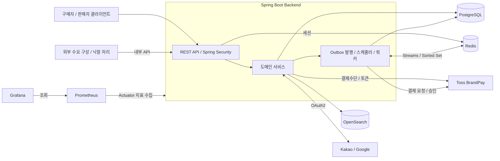
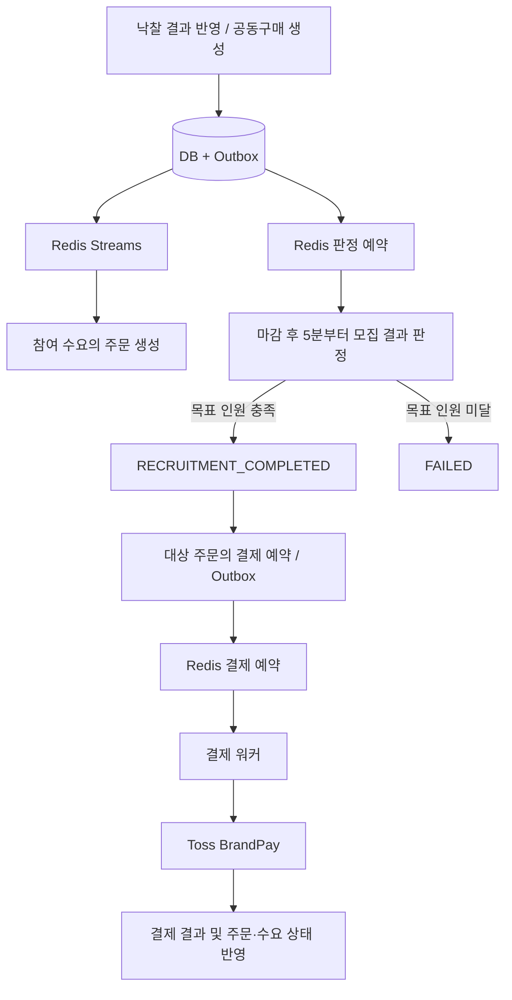

# MoongCheap Backend

**구매자의 수요를 모아 판매자의 제안과 연결하는 수요 기반 공동구매 서비스, 뭉칩의 백엔드입니다.**

구매자는 원하는 상품·가격대·수량을 등록하고, 판매자는 모인 수요에 맞춰 판매 조건을 제안합니다. 백엔드는 수요보드 구성 및 낙찰 결과 반영부터 공동구매 모집, 주문 생성,
Toss BrandPay 자동결제까지의 흐름을 관리합니다.

## 핵심 기능

| 기능             | 설명                                                                                   |
|------------------|----------------------------------------------------------------------------------------|
| 회원·인증        | 자체 회원가입·로그인, Kakao·Google OAuth2 로그인, 소셜 계정 연동·해제, Redis 세션 관리 |
| 회원 정보·판매자 | 프로필·배송지 관리, 판매자 등록, 판매자 공개 정보 조회                                 |
| 상품 탐색        | 상품 도감·카테고리 조회, OpenSearch 상품명 검색, 검색 장애 시 PostgreSQL 폴백          |
| 수요 등록·매칭   | 희망 가격대·수량·유효기간을 포함한 수요 접수, 수요보드 참여, 대체상품 제안 수락·거절   |
| 응찰·낙찰        | 판매자 응찰 등록, 내부 API를 통한 낙찰 평가 결과 반영, 낙찰 결과 조회                  |
| 공동구매         | 공동구매 목록·상세 조회, 모집 마감 후 목표 인원 충족 여부 판정                         |
| 주문             | Redis Streams 기반 비동기 주문 생성, 주문 목록·상세 조회, 주문 배송지 변경·취소        |
| 결제             | BrandPay 결제수단·토큰 관리, 자동결제 예약·실행, 재시도 및 누락 예약 복구              |
| 알림 설정        | 알림 유형별 수신 설정 관리                                                             |

수요보드 구성·대체상품 제안·낙찰 결과는 내부 API로 전달받습니다. 이 저장소는 결과를 검증하고 도메인 상태에 반영하는 백엔드이며, 외부 AI 처리 로직 자체는 포함하지
않습니다.

## 기술 스택

| 구분             | 기술                                                      | 용도                                      |
|------------------|-----------------------------------------------------------|-------------------------------------------|
| Language         | Java 25                                                   | 애플리케이션 개발                         |
| Framework        | Spring Boot 4.1.0, Spring MVC                             | REST API                                  |
| Build            | Gradle 9.5.1                                              | 빌드·테스트, Wrapper 제공                 |
| Persistence      | Spring Data JPA, Hibernate, PostgreSQL 16                 | 도메인 데이터 저장                        |
| Migration        | Flyway                                                    | DB 스키마 버전 관리                       |
| Authentication   | Spring Security, OAuth2 Client, Spring Session Data Redis | 인증·인가 및 세션                         |
| Queue / Schedule | Redis 7, Streams, Sorted Set                              | 주문 이벤트 소비, 공동구매 판정·결제 예약 |
| Search           | OpenSearch 2.15.0, OpenSearch Java Client 2.11.0          | 상품 검색                                 |
| Resilience       | Resilience4j 2.4.0                                        | 재시도·서킷 브레이커                      |
| Payment          | Toss Payments BrandPay                                    | 결제수단 등록·자동결제 연동               |
| API Docs         | springdoc-openapi, Swagger UI                             | API 명세                                  |
| Observability    | Actuator, Micrometer, Prometheus, Grafana                 | 상태·성능·처리 지연 관측                  |
| Test             | JUnit, Mockito, Testcontainers, JaCoCo, k6                | 단위·통합·동시성·부하 테스트              |
| CI / Delivery    | GitHub Actions, Jenkins, Docker, Amazon ECR, GitOps       | 검증·이미지 빌드 및 배포 설정 갱신        |

## Member

| 기여자     | 참여 저장소        | 담당 도메인                                  |
|------------|--------------------|----------------------------------------------|
| `jnj3j3`   | MoongCheap Backend | 회원, 인증, 수요, 상품, 카테고리, 알림, 예외 | 
| `zzimzzim` | MoongCheap Backend | 공동구매, 주문, 결제, OutBox                 |

## 시스템 아키텍처


도메인별 패키지로 분리된 단일 Spring Boot 애플리케이션입니다. API, 스케줄러, 이벤트 소비자, 결제 워커가 같은 애플리케이션 코드에 포함되며, 아래 그림은 코드와
설정에서 확인할 수 있는 논리 구성입니다.



### 주문·판정·결제 처리

공동구매 생성 시 DB 변경과 Outbox 이벤트를 같은 트랜잭션에 기록합니다. 이후 주문 생성 이벤트는 Redis Streams로, 마감 판정 예약은 Redis Sorted
Set으로 발행됩니다.



- **중복 처리 제어:** DB 상태 조건·잠금·유니크 제약과 결제 멱등키를 사용합니다.
- **예약 복구:** DB에 남은 처리 대상을 확인해 유실된 Redis 예약을 보완합니다. 공동구매 판정 예약은 기본적으로 마감 후 65분이 지난 `OPEN` 건부터 복구 후보가
  됩니다.
- **시간 기준:** JVM과 Hibernate의 시간 기준은 `Asia/Seoul`입니다. 수요·보드 만료는 DB의 `CURRENT_TIMESTAMP`와 비교합니다.
- **결제 실행 설정:** 자동결제 큐는 기본 비활성화되어 있으며 `PAYMENT_QUEUE_ENABLED=true`로 활성화합니다.

예약 복구의 범위와 알려진 한계는 [마감·공동구매 판정 버그 리포트](docs/deadline-and-judgment-bug-report.md)에 정리되어 있습니다.

### CI / Delivery

GitHub Actions의 검증 워크플로와 Jenkins 파이프라인을 제공합니다. Jenkins는 빌드·테스트·보안 검사 후 컨테이너 이미지를 ECR에 게시하고, 별도
GitOps 저장소의 이미지 태그 갱신 PR을 처리합니다. 실제 배포 리소스는 해당 저장소에서 관리하며, 이 README의 구성도는 운영 배포 상태를 보증하지 않습니다.

## ERD

주요 업무 테이블의 관계를 요약한 ERD입니다. 인증 상세, 알림, 정산, Outbox 및 일부 컬럼은 생략했습니다.

https://www.erdcloud.com/d/sckTas8im4zdGZPsw


`demand_board`는 구매자의 수요를 묶고 응찰을 받는 단위이고, `group_buy`는 낙찰 상품의 모집과 주문을 관리하는 단위입니다. 주문에는 상품·가격·배송지 정보를
스냅샷으로 저장합니다. 결제는 주문별 시도 이력을 가질 수 있으며, 활성 결제의 중복은 부분 유니크 인덱스로 제한합니다.

## 로컬 실행

Java 25와 Docker Compose가 필요합니다. 기본 프로파일은 `local`이며 PostgreSQL, Redis, OpenSearch 연결값이 로컬 설정에 정의되어
있습니다.

```bash
# 저장소 루트에서 실행
docker compose -f docker/docker-compose.local.yml up -d postgres redis opensearch
./gradlew bootRun --args='--spring.profiles.active=local'
```

시작 시 Flyway가 스키마를 적용합니다. OAuth 로그인이나 BrandPay 연동을 테스트하려면 [.env.example](.env.example)을 참고해 루트의
`.env`에 해당 키를 설정합니다. 로컬 OAuth 기본값은 자리표시자이므로 실제 소셜 로그인에는 발급받은 키가 필요합니다.

| 항목       | 주소                                  |
|------------|---------------------------------------|
| API        | http://localhost:8080                 |
| Swagger UI | http://localhost:8080/swagger-ui.html |
| OpenAPI    | http://localhost:8080/v3/api-docs     |
| Health     | http://localhost:8080/actuator/health |

결제 큐를 시험할 때는 `PAYMENT_QUEUE_ENABLED=true`를 설정합니다. `PAYMENT_GATEWAY_MODE=mock`은 결제 실행을 앱 내부 모의 구현으로
전환하지만 결제수단 등록·인증 API까지 대체하지는 않습니다. 상세 절차는 [BrandPay 테스트 도구](tools/brandpay-test/README.md)를 참고하세요.

## 테스트·모니터링

```bash
# 전체 테스트: Testcontainers 실행을 위한 Docker 필요
./gradlew test

# 컨테이너 기반 테스트 제외
./gradlew test -PskipContainerTests

# 실행 가능한 JAR 생성
./gradlew bootJar
```

테스트 실행 후 JaCoCo HTML 리포트는 `build/reports/jacoco/test/html/index.html`에 생성됩니다. 테스트
범위는 [테스트 문서](docs/tests/README.md), 부하 테스트 실행법은 [부하 테스트 가이드](tools/load-test/README.md)를 참고하세요.

로컬 모니터링은 저장소 컨테이너를 실행한 뒤 다음 명령으로 추가할 수 있습니다.

```bash
docker compose -f docker/docker-compose.local.yml up -d --no-deps postgres-exporter redis-exporter cadvisor prometheus grafana
```

Prometheus는 `http://localhost:9090`, Grafana는 `http://localhost:3001`에서 확인합니다. Grafana의 로컬 초기 계정은
`admin / admin`이며, `GRAFANA_ADMIN_PASSWORD`로 비밀번호를 변경할 수 있습니다. cAdvisor 구성은 Linux Docker 호스트 기준입니다.

## 문서 역사

| 2026.10.02 | 최초생성 |
|------------|----------|

## 관련 문서

| 문서                                                                       | 내용                                 |
|----------------------------------------------------------------------------|--------------------------------------|
| [개발 컨벤션](docs/convention.md)                                          | 코드 작성 규칙                       |
| [API 에러 응답](docs/api-error-responses.md)                               | 엔드포인트별 비즈니스 에러           |
| [상태값 정리](docs/status.md)                                              | 도메인 상태와 전이                   |
| [BrandPay 연동 가이드](docs/brandpay-frontend-integration-guide.md)        | 프런트엔드 연동 절차                 |
| [Redis 결제 큐 설계](docs/brandpay-redis-sorted-set-design.md)             | 결제 예약·실행·복구 구조             |
| [주문·판정·결제 메트릭](docs/order-judgment-payment-metrics.md)            | 처리량·지연·적체 관측                |
| [마감·공동구매 판정 버그 리포트](docs/deadline-and-judgment-bug-report.md) | 시간대 불일치 및 판정 예약 유실 대응 |
| [주문 배송비 수정](docs/order-delivery-fee-fix.md)                         | 주문 금액 계산과 결제 금액 정합성    |
