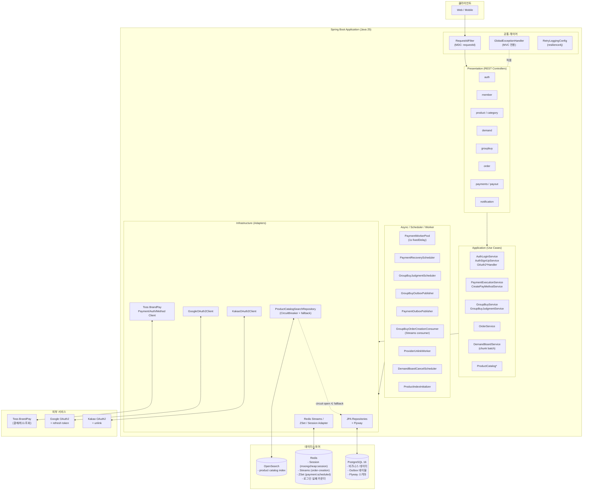
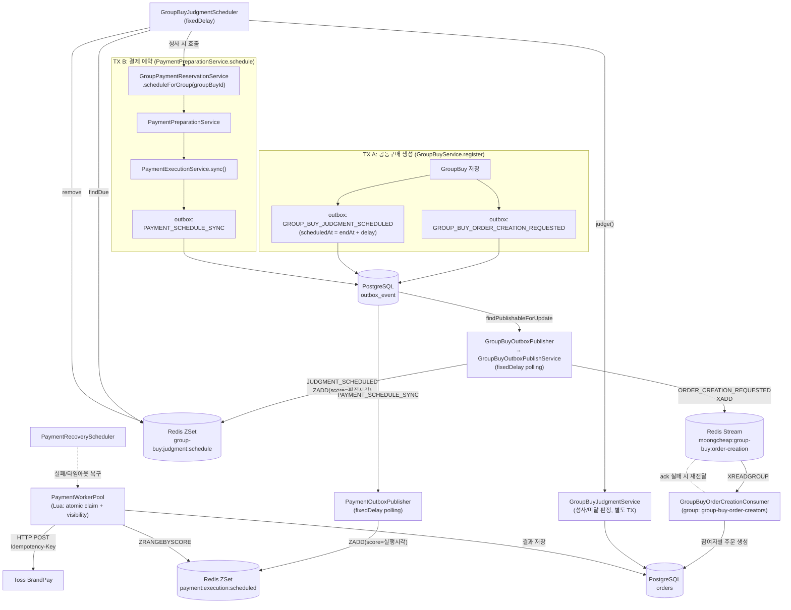
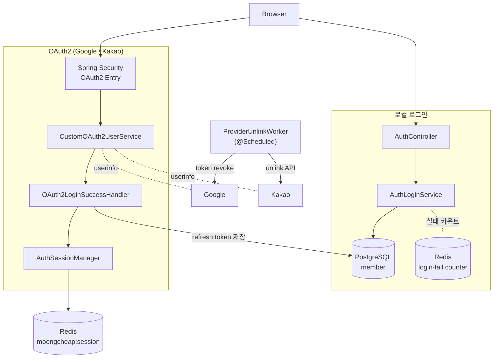

# 시스템 아키텍처

MoongCheap 백엔드(Spring Boot, Java 25)의 전체 시스템 구성과 주요 흐름을 정리한다.

## 1. 전체 아키텍처

## 2. 비동기 메시징 흐름 (Outbox + Streams + ZSet)

Outbox는 세 종류의 이벤트를 가진다 (`OutboxEventType`):
`GROUP_BUY_ORDER_CREATION_REQUESTED`, `GROUP_BUY_JUDGMENT_SCHEDULED`, `PAYMENT_SCHEDULE_SYNC`.
공동구매 생성 트랜잭션에서 앞 두 개가 함께 INSERT 되고, 결제 쪽은 판정 성사 이후 별도 트랜잭션에서 세 번째 이벤트가 INSERT 된다.

핵심:
- **Outbox 생성은 두 지점**뿐이다: ① 공동구매 생성 TX에서 주문요청·판정예약 2건, ② 판정 성사 뒤 결제 예약 TX에서 1건.
- 주문 생성(Order) 자체는 Outbox를 만들지 않는다. 주문은 Stream 메시지를 받은 Consumer가 생성한다.
- 결제는 "판정 → 예약 → outbox → publisher → ZSet → worker" 순서로 흐른다.

## 3. 인증 흐름

## 핵심 포인트

- **헥사고날 4-레이어**: `presentation → application → domain → infrastructure`를 도메인별로 반복.
- **데이터 저장소 역할 분리**: PostgreSQL(사실 소스), Redis(세션/큐/카운터), OpenSearch(검색, 서킷 열리면 Postgres로 폴백).
- **이벤트는 Outbox 경유**: 비즈니스 트랜잭션에서 outbox 테이블 insert만 하고, 별도 퍼블리셔가 Redis Streams/ZSet로 발행하여 at-least-once를 보장.
- **GlobalExceptionHandler는 MVC 요청 전용**: `@Scheduled`·`@Async`·Streams 컨슈머·`PaymentWorkerPool`·`ProviderUnlinkWorker`는 자체 try/catch로 로깅 책임.
- **외부 호출은 resilience4j로 감쌈**: Toss는 Idempotency-Key, OpenSearch는 CircuitBreaker + Postgres fallback.
