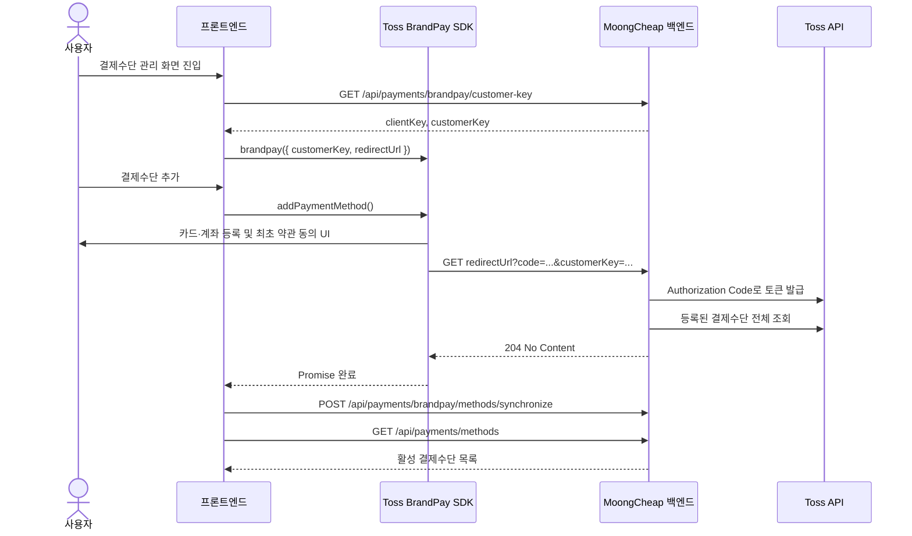
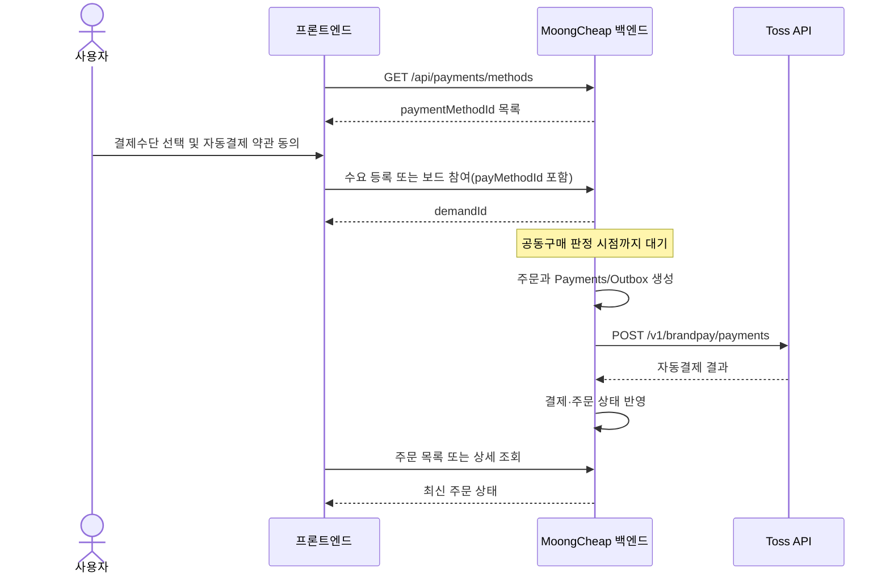

# 프론트엔드 BrandPay 연동 가이드

## 1. 목적과 적용 범위

이 문서는 MoongCheap 프론트엔드에서 토스페이먼츠 BrandPay SDK와 백엔드 결제 API를
연결하는 방법을 설명한다.

우리 서비스는 BrandPay를 다음 용도로 사용한다.

1. 사용자가 프론트에서 카드 또는 계좌를 등록한다.
2. 프론트는 등록된 결제수단의 **로컬 ID**를 수요 등록·수요 보드 참여 요청에 포함한다.
3. 공동구매가 성사되면 백엔드가 저장된 결제수단으로 자동결제를 실행한다.

따라서 프론트엔드는 BrandPay SDK의 `addPaymentMethod()`만 사용한다. 자동결제를 위해
`brandpay.requestPayment()`를 호출하거나 토스 REST API를 직접 호출하지 않는다.

## 2. 프론트와 백엔드의 책임

| 구분 | 프론트엔드 | 백엔드 |
| --- | --- | --- |
| SDK 초기화 | 클라이언트 키와 `customerKey`로 초기화 | 로그인 회원의 키를 발급·반환 |
| 결제수단 등록 UI | `addPaymentMethod()` 실행 | 인증 코드로 토큰 발급 후 결제수단 동기화 |
| 결제수단 표시 | 백엔드 목록 응답 렌더링 | 토스 원본을 로컬 DB에 저장하여 반환 |
| 결제수단 선택 | 로컬 `paymentMethodId` 선택 | 회원 소유·활성 상태 검증 |
| 자동결제 동의 | 약관 UI 제공 및 동의값 전송 | 필수 동의값 검증 |
| 자동결제 실행 | 실행하지 않음 | 공동구매 성사 후 큐와 워커가 실행 |
| 시크릿·토큰 관리 | 절대 저장하거나 전달받지 않음 | 시크릿 키, Access Token, Refresh Token 관리 |

프론트에서 사용하는 결제수단 ID는 토스의 `methodKey`가 아니라 백엔드 DB의 숫자형
`id`다. `methodKey`는 프론트 응답에 포함하지 않는다.

## 3. 전체 흐름

### 3.1 결제수단 등록



최초 인증에서는 백엔드 콜백이 토큰 발급과 동기화를 함께 수행한다. 이미 인증된 고객은
콜백 없이 `addPaymentMethod()`의 Promise만 완료될 수 있으므로, 프론트는 Promise 완료
후 동기화 API를 항상 한 번 호출한다.

### 3.2 수요 등록부터 자동결제까지



자동결제는 사용자 버튼 클릭 직후 실행되는 일반 결제가 아니다. 사용자가 수요에 참여할
때 결제수단과 자동결제 동의를 저장하고, 이후 공동구매 성사 판정이 끝난 시점에 서버가
청구한다.

## 4. SDK 설치와 초기화

### 4.1 npm 사용

```bash
npm install @tosspayments/tosspayments-sdk
```

```ts
import { loadTossPayments } from "@tosspayments/tosspayments-sdk";

const API_ORIGIN = import.meta.env.VITE_API_ORIGIN;
const BRANDPAY_REDIRECT_URL = import.meta.env.VITE_BRANDPAY_REDIRECT_URL;

type BrandPayConfig = {
  clientKey: string;
  customerKey: string;
};

async function api<T>(path: string, init: RequestInit = {}): Promise<T> {
  const response = await fetch(`${API_ORIGIN}${path}`, {
    ...init,
    credentials: "include",
    headers: {
      "Content-Type": "application/json",
      ...init.headers,
    },
  });

  if (!response.ok) {
    const body = await response.json().catch(() => null);
    throw new ApiError(response.status, body);
  }

  return response.status === 204
    ? (undefined as T)
    : response.json();
}

export async function initializeBrandPay() {
  const config = await api<BrandPayConfig>(
    "/api/payments/brandpay/customer-key",
  );
  const tossPayments = await loadTossPayments(config.clientKey);

  return tossPayments.brandpay({
    customerKey: config.customerKey,
    redirectUrl: BRANDPAY_REDIRECT_URL,
  });
}
```

`ApiError`는 프론트 프로젝트의 공통 API 오류 클래스로 대체한다. React를 사용한다면
`brandpay` 인스턴스를 렌더링마다 다시 생성하지 말고 로그인 회원 단위로 상태 또는
`ref`에 보관한다. 로그아웃하거나 회원이 바뀌면 인스턴스를 폐기하고 다시 초기화한다.

### 4.2 script 태그 사용

패키지 설치가 어려우면 V2 SDK를 직접 로드할 수 있다.

```html
<script src="https://js.tosspayments.com/v2/standard"></script>
```

```js
const config = await api("/api/payments/brandpay/customer-key");
const tossPayments = window.TossPayments(config.clientKey);
const brandpay = tossPayments.brandpay({
  customerKey: config.customerKey,
  redirectUrl: BRANDPAY_REDIRECT_URL,
});
```

V1 SDK와 V2 초기화 코드를 섞지 않는다.

## 5. 결제수단 등록 구현

```ts
async function addBrandPayMethod(brandpay: BrandPayInstance) {
  try {
    await brandpay.addPaymentMethod();

    // 기존 인증 고객은 콜백 없이 등록이 끝날 수 있으므로 항상 명시적으로 동기화한다.
    await api<void>("/api/payments/brandpay/methods/synchronize", {
      method: "POST",
    });

    return await api<PaymentMethod[]>("/api/payments/methods");
  } catch (error) {
    if (isTossUserCancel(error)) {
      // 오류 알림이 아니라 사용자가 창을 닫은 정상적인 취소로 처리한다.
      return null;
    }
    throw error;
  }
}
```

구현 시 다음 규칙을 지킨다.

- 버튼을 누른 직후 비활성화하여 SDK 창을 중복으로 열지 않는다.
- 성공 여부는 SDK Promise만으로 판단하지 않고 동기화와 목록 재조회까지 완료한 뒤 표시한다.
- 사용자가 SDK 창을 닫은 `USER_CANCEL`은 장애로 기록하지 않는다.
- 동기화가 실패하면 “등록 실패”로 단정하지 말고 “목록 동기화 실패, 다시 시도”로 안내한다.
- `customerKey`는 백엔드 응답값을 그대로 사용하며 프론트에서 새로 생성하거나 변형하지 않는다.

## 6. 백엔드 API 계약

모든 API에는 로그인 세션이 필요하다. 프론트와 API 서버의 Origin이 다르면 모든
`fetch` 요청에 `credentials: "include"`를 설정한다.

### 6.1 SDK 설정 조회

```http
GET /api/payments/brandpay/customer-key
```

```json
{
  "clientKey": "test_ck_...",
  "customerKey": "random-customer-key"
}
```

- `clientKey`는 브라우저 SDK 초기화에 사용할 수 있는 공개 키다.
- `customerKey`는 로그인 회원에게 고정된 값이다.
- 응답값을 `localStorage`, 분석 이벤트 또는 오류 추적 도구에 기록하지 않는다.

### 6.2 브랜드페이 인증 콜백

```http
GET /api/payments/brandpay/callback?code={authorizationCode}&customerKey={customerKey}
```

이 API는 프론트가 직접 호출하지 않는다. BrandPay SDK가 `redirectUrl`로 호출하며,
백엔드는 Authorization Code를 토큰으로 교환하고 결제수단을 동기화한 뒤 리다이렉트 없이
`204 No Content`를 반환한다. 이전의 프론트 전달 방식인
`POST /api/payments/brandpay/authorization`은 제거되었으므로 호출하지 않는다.

### 6.3 결제수단 재동기화

```http
POST /api/payments/brandpay/methods/synchronize
```

성공 응답은 `204 No Content`다. 응답 JSON을 파싱하지 않는다.

### 6.4 결제수단 목록

```http
GET /api/payments/methods
```

```json
[
  {
    "id": 12,
    "provider": "신한카드",
    "number": "1234",
    "isDefault": true,
    "status": "ACTIVE"
  }
]
```

```ts
type PaymentMethodStatus = "ACTIVE" | "INACTIVE";

type PaymentMethod = {
  id: number;
  provider: string;
  number: string | null;
  isDefault: boolean;
  status: PaymentMethodStatus;
};
```

백엔드는 `EXPIRED` 상태를 목록에서 제외한다. 프론트는 `ACTIVE`만 선택할 수 있게 하고
`INACTIVE`는 표시하되 자동결제 수단으로 선택하지 못하게 한다. 카드·계좌 원문 번호가
아니라 백엔드가 반환한 마스킹용 값만 표시한다.

### 6.5 결제수단 삭제

```http
DELETE /api/payments/methods/{paymentMethodId}
```

성공 응답은 `204 No Content`다. 여기서 `paymentMethodId`는 목록 응답의 숫자형 `id`다.
삭제 성공 후 목록을 다시 조회하고, 이미 수요에 사용 중인 수단의 처리 정책은 백엔드
오류 응답에 따라 안내한다.

### 6.6 기본 결제수단 변경

```http
PATCH /api/payments/methods/{paymentMethodId}/default
```

성공 응답은 `204 No Content`다. 로그인 회원이 소유한 `ACTIVE` 결제수단만 기본으로
지정할 수 있다. 변경 성공 후 결제수단 목록을 다시 조회한다.

### 6.7 결제 취소

```http
PATCH /api/payments/{paymentId}
Content-Type: application/json

{
  "cancelReason": "고객 요청"
}
```

성공 응답은 `204 No Content`다. 주문 ID나 주문번호가 아니라 백엔드의 `paymentId`를
사용한다. 현재 정책상 일반 사용자가 노출된 UI에서 직접 호출할지 여부는 별도로 확정해야
하므로, 기획 승인 전에는 관리자 또는 정해진 주문 취소 흐름에서만 연결한다.

## 7. 수요 등록에 결제수단 연결

### 7.1 새 수요 등록

```http
POST /api/members/me/demand
Content-Type: application/json
```

```json
{
  "catalogId": 10,
  "payMethodId": 12,
  "desiredPriceMin": 9000,
  "desiredPriceMax": 11000,
  "quantity": 1,
  "extraRequirement": "문 앞에 놓아주세요",
  "isSubstitutable": false,
  "autoPaymentAgreed": true,
  "privacyCollectionAgreed": true,
  "privacyThirdPartyAgreed": true,
  "paymentAgencyTermsAgreed": true
}
```

### 7.2 기존 수요 보드 참여

```http
POST /api/demand-boards/{demandBoardId}/join
Content-Type: application/json
```

```json
{
  "payMethodId": 12,
  "quantity": 1,
  "isSubstitutable": false,
  "extraRequirement": "",
  "autoPaymentAgreed": true,
  "privacyCollectionAgreed": true,
  "privacyThirdPartyAgreed": true,
  "paymentAgencyTermsAgreed": true
}
```

`payMethodId`에는 `GET /api/payments/methods`에서 선택한 `ACTIVE` 수단의 `id`를 넣는다.
네 가지 동의값은 모두 `true`여야 한다. 체크박스를 하나로 묶어 보여주더라도 요청에는
각 동의값을 구분해서 보낸다.

수요 등록 요청이 성공했다고 결제가 끝난 것은 아니다. 화면 문구도 “결제 완료”가 아니라
“공동구매 성사 시 선택한 수단으로 자동결제됩니다”로 표시한다.

## 8. 주문과 결제 결과 표시

자동결제 결과는 SDK 콜백으로 프론트에 돌아오지 않는다. 다음 주문 API로 서버에 반영된
상태를 조회한다.

```http
GET /api/orders/list
GET /api/orders/{orderNo}
```

주요 주문 상태 표시는 다음 기준을 사용한다.

| 상태 | 사용자 표시 예시 |
| --- | --- |
| `PAYMENT_PENDING` | 결제 대기 중 |
| `PAYMENT_COMPLETED` | 결제 완료 |
| `PAYMENT_FAILED` | 결제 실패 |
| `REFUNDED` | 환불 완료 |

화면에서 토스 결제를 직접 재시도하지 않는다. 재시도와 `UNKNOWN`, `REVIEW_REQUIRED`
판단은 백엔드 워커의 책임이다. 결제 실패 시 사용자가 할 수 있는 조치가 정해지기 전까지는
주문 상세에 상태와 고객센터 안내를 표시한다.

## 9. 리다이렉트 URL과 세션 설정

### 9.1 개발 환경

현재 로컬·개발 테스트에서 검증된 리다이렉트 URL은 다음과 같다.

```text
http://localhost:8080/api/dev/brandpay-test/callback
```

토스페이먼츠 개발자센터에 등록한 값, 프론트 환경변수, SDK 초기화에 넘기는 값이 문자
단위로 같아야 한다. 슬래시, 프로토콜, 포트가 달라도 다른 URL이다.

### 9.2 운영 환경

운영용 GET 콜백은 `PaymentController`에 구현되어 있으며 운영 리다이렉트 URL은 다음과
같다.

```text
https://api.moongcheap.shop/api/payments/brandpay/callback
```

토스페이먼츠 개발자센터 등록값과 프론트의 `VITE_BRANDPAY_REDIRECT_URL`에 위 주소를
동일하게 설정한다. 프론트 라우트, 개발용 URL 또는 삭제된
`POST /api/payments/brandpay/authorization`을 운영 인증 흐름에 사용하지 않는다.

### 9.3 CORS와 쿠키

- 백엔드 `ALLOWED_ORIGINS`에 정확한 프론트 Origin을 등록한다.
- 프론트 요청에는 항상 `credentials: "include"`를 설정한다.
- 와일드카드 Origin과 credential 쿠키를 함께 사용하지 않는다.
- 운영은 HTTPS를 사용하고 세션 쿠키의 `Secure` 속성을 유지한다.
- 프론트와 API가 서로 다른 사이트라면 `SameSite=Lax` 쿠키가 콜백 요청에 포함되지 않을
  수 있으므로 도메인 구성 또는 `SameSite=None; Secure` 적용을 백엔드와 함께 검토한다.

콜백 성공 시 백엔드는 `204 No Content`를 직접 반환해야 한다. 콜백에서 프론트 정적
페이지로 다시 `302` 리다이렉트하면 SDK의 교차 출처 요청과 CORS preflight가 추가되어
`customerToken이 존재하지 않습니다` 오류로 이어질 수 있다.

## 10. 오류 처리 지침

| 상황 | 프론트 처리 |
| --- | --- |
| API `401` | 로그인 화면으로 유도하고 SDK 인스턴스 폐기 |
| SDK `USER_CANCEL` | 오류 알림 없이 등록 취소로 표시 |
| `customerToken이 존재하지 않습니다` | 리다이렉트 URL, 콜백 HTTP 상태, 세션 쿠키부터 확인 |
| 동기화 실패 | 재동기화 버튼 제공, 기존 목록을 즉시 삭제하지 않음 |
| 결제수단 없음 | 결제수단 등록 CTA 표시 |
| 선택 수단이 비활성·삭제됨 | 목록 재조회 후 다른 수단 선택 유도 |
| 수요 등록 `400` | 필수 동의, 수량, 금액 범위 확인 |
| 수요 등록 `409` | 이미 진행 중인 수요가 있음을 안내 |
| 자동결제 실패 | 프론트에서 Toss API 재호출 금지, 서버 주문 상태 표시 |

오류 로그에 다음 값을 남기지 않는다.

- Authorization Code
- Access Token과 Refresh Token
- `methodKey`
- 시크릿 키와 보안 키
- 전체 `customerKey`
- 카드·계좌 전체 번호

문제 추적에는 발생 시각, 로그인 회원의 내부 ID, API 경로, HTTP 상태, 백엔드 오류 코드,
주문번호처럼 서버에서 안전하다고 정의한 식별자만 사용한다.

## 11. 프론트 구현 체크리스트

- [ ] V2 SDK만 사용한다.
- [ ] SDK 설정은 `GET /api/payments/brandpay/customer-key`에서 받는다.
- [ ] 모든 백엔드 요청에 세션 credential을 포함한다.
- [ ] `redirectUrl`은 환경변수로 관리하고 개발자센터 등록값과 일치시킨다.
- [ ] 운영 `redirectUrl`은 `https://api.moongcheap.shop/api/payments/brandpay/callback`을 사용한다.
- [ ] `addPaymentMethod()` 완료 후 재동기화와 목록 재조회를 수행한다.
- [ ] 결제수단 선택값으로 로컬 `id`를 사용한다.
- [ ] `INACTIVE` 수단은 선택할 수 없게 한다.
- [ ] 수요 등록 시 네 가지 필수 동의를 각각 전송한다.
- [ ] 프론트에서 `requestPayment()`나 토스 자동결제 REST API를 호출하지 않는다.
- [ ] 자동결제 결과는 주문 API로 조회한다.
- [ ] 시크릿, 토큰, Authorization Code, `methodKey`를 저장하거나 로그로 남기지 않는다.
- [ ] 중복 클릭과 중복 SDK 초기화를 방지한다.
- [ ] 삭제된 `POST /api/payments/brandpay/authorization`을 호출하지 않는다.

## 12. 참고 자료

- [토스페이먼츠 BrandPay JavaScript SDK](https://docs.tosspayments.com/sdk/v2/js/brandpay)
- [토스페이먼츠 BrandPay 인증](https://docs.tosspayments.com/guides/v2/brandpay/auth)
- [토스페이먼츠 BrandPay API](https://docs.tosspayments.com/reference/brandpay)
- [프로젝트 테스트 콘솔](../tools/brandpay-test/README.md)
- [BrandPay 테스트 케이스](./brandpay-test-cases.md)
- [customerToken 문제 해결 기록](./brandpay-customer-token-troubleshooting.md)
