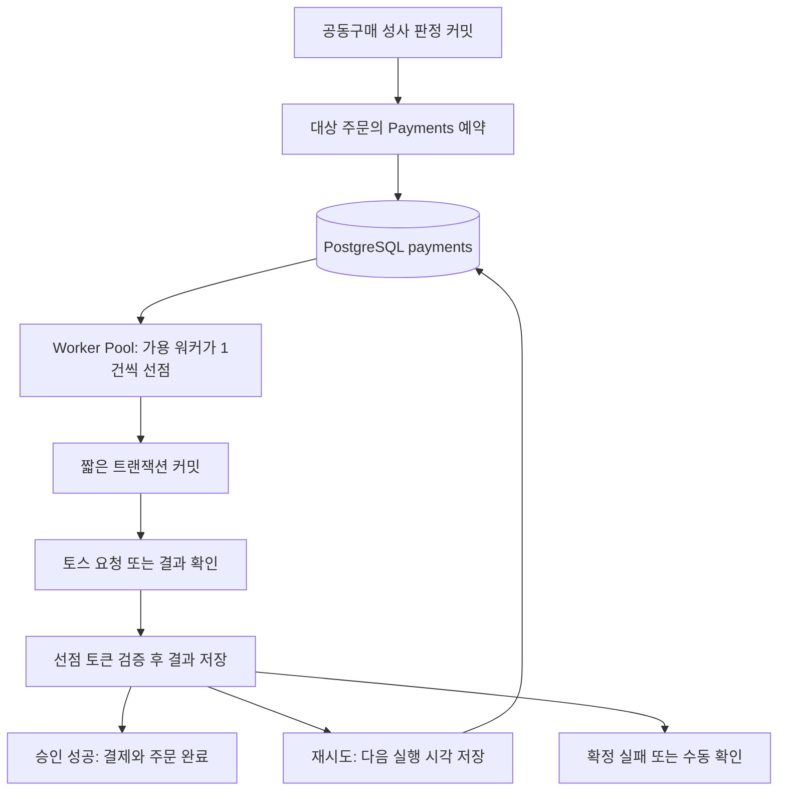

# 브랜드페이 자동결제: PostgreSQL 큐 + Worker Pool 설계

작성일: 2026-09-22

상태: DB 큐 구현은 롤백했다. 아래 구현·마이그레이션·검증 내용은 당시 기록이며 현재 코드에 적용된 상태가 아니다. 후속 방향은 [Redis Sorted Set 설계](brandpay-redis-sorted-set-design.md)를 참고한다. 설계 배경은 [논의 기록](brandpay-design-history.md)에 남긴다.

## 1. 목표와 전제

최초 자동결제와 재시도를 PostgreSQL에 예약하고, 제한된 Worker Pool이 같은 실행 경로로 처리한다. 결제 작업을 위한 Redis Sorted Set·Stream·Outbox를 추가하지 않는다. 기존 공동구매용 Redis 기능은 별개다.

- 공동구매 판정 이전에만 주문 취소를 허용한다. 성사 판정이 커밋된 주문만 결제 예약 대상이다.
- 토스 호출 전에 로컬 Payments를 영속화한다.
- 결제 예약과 재예약은 DB 트랜잭션으로 저장한다.
- 외부 API 호출 동안 DB 트랜잭션·행 잠금을 유지하지 않는다.
- 여러 스레드·서버가 실행해도 작업 선점과 완료 처리를 보호한다.
- 중복 외부 요청 가능성은 존재한다. DB 큐는 정확히 한 번 청구를 자체 보장하지 않는다.
- 타임아웃이나 워커 종료는 미결제 확정이 아니다. 결과 불명확 건은 별도로 확인한다.

## 2. 구성



초기에는 payments 테이블에 예약·선점 필드를 함께 둔다. 별도의 범용 메시지 큐를 구현하지 않는다. 작업 갱신 부하와 결제 이력 관리가 충돌하는 시점에는 같은 DB의 payment_jobs 테이블로 분리할 수 있다.

## 3. 상태와 워커 소유권

PaymentsStatus는 외부 상태와 분리한 아래 로컬 상태를 사용한다.

| 로컬 상태 | 의미 | 자동 작업 |
| --- | --- | --- |
| PENDING | 실행 대기. 이전 요청의 불명확한 결과는 없는 상태 | 청구 가능 여부 확인 후 실행 |
| UNKNOWN | 외부 실행이 시작됐거나 시작됐을 수 있어 결과 확인이 필요한 상태 | 조회 또는 동일 요청 복구 |
| SUCCEEDED | 승인 성공을 확인하고 저장함 | 청구 종료 |
| FAILED | 미결제로 확정하고 해당 결제 시도를 종료함 | 청구 종료 |
| CANCELED | 승인된 결제의 전액 취소를 확인함 | 청구 종료 |

PROCESSING은 결제 결과 enum에 넣지 않는다. 처리 중 여부는 processing_token과 processing_deadline으로 표현한다. 따라서 UNKNOWN 작업을 워커가 선점해도 결과가 불명확하다는 정보가 유지된다.

UNKNOWN은 네트워크 오류를 받은 경우뿐 아니라 **토스 호출 직전 결과 불명확 가능성을 기록하는 상태**로도 사용한다. DB 기록과 실제 네트워크 송신을 원자적으로 묶을 수 없으므로, 이 직후 서버가 종료되면 실제 요청 전인지 후인지 확정할 수 없기 때문이다.

토스 원본 상태를 별도 컬럼으로 저장하지 않는다. 로컬 스케줄링 판단은 로컬 상태를 기준으로 한다. 부분 취소와 환불 실행 큐는 이번 청구 큐 설계 범위 밖이며, 도입 시 상태를 확장한다.

## 4. Payments 데이터 모델

기존 주문 연결, 주문번호, 상품명, 금액, paymentKey, 승인 시각은 유지한다.

큐 전용 필드는 다음 5개만 사용한다.

| 필드 | 타입 | 역할 |
| --- | --- | --- |
| next_attempt_at | timestamptz, nullable | 다음 자동 실행 시각 |
| attempt_count | integer, 기본값 0 | 워커 실행 시작 횟수(청구·조회 통합) |
| processing_token | UUID, nullable | 현재 선점 소유자 토큰 |
| processing_deadline | timestamptz, nullable | 선점 임대 만료 시각 |
| idempotency_key | varchar, unique | 동일 결제 재전송에 사용할 고정 키 |

기존 status와 created_at을 함께 사용한다. 결제 요청을 고정하기 위한 brand_pay_method_id와 customer_key_snapshot은 큐 관리 필드가 아니라 결제 정보이므로 유지한다.

reconciliation_count, last_attempted_at, first_requested_at, last_failure_code, review_required, provider_status, request_version은 제거한다. 실패 사유는 안전한 오류 코드 로그로 확인하며 DB에 별도로 저장하지 않는다.

### 필드 사용 규칙

- 최초 예약: PENDING, next_attempt_at=DB 현재 시각, 선점 필드=null.
- 선점: 결제 결과 상태를 유지하며 토큰과 임대 만료 시각을 설정한다.
- 외부 요청 시작 전: UNKNOWN과 attempt_count 증가를 커밋한다.
- 완료·재예약·중단: 소유권 검증 후 선점 필드를 함께 해제한다.
- 횟수 또는 기간 제한으로 자동 처리를 중단하면 UNKNOWN으로 두고 next_attempt_at과 processing_token을 모두 null로 만든다. 이 조합으로 수동 확인 대상을 식별한다.
- attempt_count는 선점 후 begin()에서 실행을 시작할 때 한 번 증가한다. 같은 실행의 조회 → 재전송은 추가 증가하지 않는다. 선점만 하고 종료되면 증가하지 않으며, 시작 기록 직후 송신 전에 종료되어도 1회를 소모한다.
- 현재 시각과 임대는 DB 시각(Instant)을 기준으로 한다. 재전송 기간은 기존 createdAt부터 계산한다. createdAt은 JPA auditing이 기록하는 LocalDateTime이므로 JVM 기본 시간대로 Instant로 변환한다. 모든 서버와 기존 데이터의 시간대를 일치시켜야 한다. 생성 시각이 없거나 기간이 지났으면 최초 실행도 포함해 자동 처리를 중단한다.

결제수단 참조와 고객 식별자는 변경 가능한 주문 정보에서 매번 다시 선택하지 않는다. methodKey가 불변이라는 조건으로 고정된 BrandPayMethod를 참조하고, UNKNOWN 복구가 필요한 동안 키를 지우지 않는다. 식별자와 인증 정보는 로그에 노출하지 않으며 저장 정책은 기존 보안 규칙에 맞춘다.

## 5. 최초 예약과 중복 생성 방지

```text
scheduleAutomaticPayment(orderId)
  → 주문 행 잠금
  → 공동구매 성사 및 결제 대상 주문인지 확인
  → 기존 활성·성공 결제가 있으면 해당 paymentId 반환
  → 결제수단과 요청 정보 검증
  → Payments PENDING 생성 및 요청 스냅샷·고정 멱등키 저장
  → next_attempt_at=현재 시각
  → 커밋 후 paymentId 반환
```

같은 Payments는 주문번호, 금액, 상품명, 고객·결제수단, 과세 옵션을 재시도 중 변경하지 않는다. UNKNOWN 상태인 시도를 종료하거나 새 키로 청구해서는 안 된다. 새 결제 시도는 이전 시도의 미결제가 확정되고 비즈니스 정책상 허용된 경우에만 생성한다.

주문당 활성·성공 결제 한 건을 제한하는 부분 유니크 인덱스를 제안한다. 취소된 주문을 재청구할 수 있는지 등은 별도 정책이므로 인덱스만으로 판단하지 않는다.

```sql
CREATE UNIQUE INDEX uq_payments_active_order
ON payments (order_id)
WHERE status IN ('PENDING', 'UNKNOWN', 'SUCCEEDED');
```

위 SQL 및 이하 SQL의 status는 새 논리 컬럼명이다. 실제 마이그레이션에서는 현재 payments_status 컬럼 유지 또는 이름 변경 중 하나로 통일한다.

### 판정 후 예약 누락 방지

성사 판정 커밋 뒤 예약 호출 전에 서버가 종료될 수도 있다. 이를 위해 주기적인 예약 보완 작업이 성사된 공동구매의 결제 대상 주문 중 결제 시도가 없는 주문을 제한된 크기로 찾아 scheduleAutomaticPayment를 호출한다. FAILED·UNKNOWN 등 기존 시도가 있는 주문을 이 작업이 새로 청구하지 않는다.

취소는 판정 전까지만 가능하다는 조건을 서버에서 보장한다. 판정 시각과 실제 판정 트랜잭션 중 취소 차단 기준을 일관되게 적용하고, 취소 반영과 판정의 원자적 경계를 검증한다.

## 6. Worker Pool과 작업 선점

고정 크기 Worker Pool을 두고 **실행 가능한 워커가 DB에서 한 건을 직접 선점**한다. 여러 건을 먼저 선점한 뒤 긴 실행 대기열에 넣지 않는다.

스케줄러가 주기적으로 빈 실행 슬롯에 poll-and-run 작업을 제출할 수 있다. 프로세스 내부 슬롯 제한으로 중복 제출을 막고, 실행을 시작한 작업이 DB를 조회한다. Executor가 제출을 거절하면 아직 DB 선점 전이므로 결제 작업은 그대로 남는다.

예시 선점 조회:

```sql
SELECT id
FROM payments
WHERE status IN ('PENDING', 'UNKNOWN')
  AND next_attempt_at <= CURRENT_TIMESTAMP
  AND processing_token IS NULL
ORDER BY next_attempt_at, id
LIMIT 1
FOR UPDATE SKIP LOCKED;
```

같은 짧은 트랜잭션에서 해당 행에 새 processing_token과 processing_deadline을 저장한 뒤 커밋한다. 트랜잭션 밖으로는 paymentId·토큰·요청 스냅샷 DTO를 반환하며, 지연 로딩 엔티티를 워커에 넘기지 않는다.

SKIP LOCKED는 잠긴 행을 건너뛰므로 여러 소비자가 큐 성격의 테이블에 접근할 때 경합을 줄이는 용도로 사용할 수 있다. 엄격한 선입선출은 보장하지 않는다. [PostgreSQL SELECT 문서](https://www.postgresql.org/docs/14/sql-select.html)

## 7. 실제 청구 실행

```text
executeClaimedPayment(paymentId, processingToken)
  → 현재 토큰과 임대 유효성 확인
  → PENDING이면 최초 실행 검증
  → UNKNOWN이면 결과 확인 경로 선택
  → 필요한 요청 시작 정보를 짧은 트랜잭션으로 커밋
  → DB 트랜잭션 밖에서 토스 호출
  → 응답을 스냅샷과 비교
  → 현재 토큰으로 완료·재예약 처리
```

토스 클라이언트의 자동결제 호출은 기존 BrandPayPaymentClient를 사용하되 요청을 Payments 스냅샷에서 구성한다. 주문에서 현재 값을 다시 읽어 같은 멱등키의 요청을 변경하지 않는다.

외부 호출을 포함한 진입점에는 상위 DB 트랜잭션이 이어지지 않게 한다. 각 DB 서비스의 트랜잭션 전파와 호출 구조를 확인한다. saveAndFlush는 커밋 경계를 대신하지 않는다.

## 8. 완료와 오류 처리

### 승인 성공

짧은 트랜잭션에서 결제의 processing_token을 비교하고, 주문번호·금액 등 응답 일치를 재검증한다. Payments를 SUCCEEDED로, Orders를 PAYMENT_COMPLETED로 함께 변경한다. 선점 정보와 다음 실행 시각을 해제한다.

### 확정 거절 또는 실행 불가

신뢰할 수 있는 응답으로 미결제가 확정됐고 해당 시도를 종료하는 경우 FAILED와 주문 PAYMENT_FAILED를 함께 저장한다. 계약·인증 설정 오류는 자동 반복하지 않고 운영 확인 대상으로 표시한다. 최초 호출 전 로컬 검증 실패는 외부 요청이 없었음이 확실할 때만 미결제로 종료한다.

### 일시 오류와 결과 불명확

| 상황 | 처리 원칙 |
| --- | --- |
| 요청이 실행되지 않았음이 확실한 일시 오류 | 정책에 따라 PENDING으로 재예약 |
| 타임아웃·응답 유실·승인 후 DB 저장 실패 가능성 | UNKNOWN 유지, 확인 예약 |
| 성공 HTTP지만 응답 주문·금액 불일치 | UNKNOWN 및 운영 확인. 성공·실패를 추정하지 않음 |
| UNKNOWN 자동 확인 한도 초과 | UNKNOWN 유지, 자동 예약 중단, 수동 확인 |

HTTP 4xx/5xx만으로 청구 여부를 단정하지 않는다. 토스 오류 코드의 실행 의미와 공식 규격을 확인해 분류한다. 현재 RestClientException을 공통 예외 하나로 바꾸는 클라이언트는 이 분류를 위해 상태 코드·안전한 오류 코드·결과 불명확 여부를 구조화해야 한다.

UNKNOWN 확인은 기존 결제 조회가 가능하면 조회를 우선 고려하고, 동일 요청 복구가 필요하면 원래 멱등키와 요청을 유지한다. 구체적인 조회 엔드포인트·인증·미조회 응답 의미·멱등키 보관 기간은 구현 전에 해당 토스 규격으로 검증한다. 기간이 지났거나 안전성이 불명확하면 새 청구 대신 운영 확인으로 넘긴다.

백오프 초기 예시는 10초 → 30초 → 2분 → 10분 → 30분이며 소량의 무작위 지연을 더한다. 청구와 결과 확인은 max-attempts 하나로 제한하며 기본 5회다. 횟수 초과 자체는 결제 실패의 증거가 아니다.

## 9. 임대 만료와 오래된 워커

회수 작업은 만료된 선점 행을 SKIP LOCKED로 소량 조회한다. 외부 요청이 시작됐을 가능성이 있으면 UNKNOWN 상태로 다시 예약하고, 기존 processing_token을 해제한다. 새 워커는 새 토큰을 받는다.

모든 완료·실패·재예약 경로에서 현재 토큰 일치를 확인한다. 예를 들어 다음 UPDATE가 0건이면 해당 워커는 소유권을 잃었으므로 주문 상태도 변경하지 않는다.

```sql
UPDATE payments
SET status = :new_status,
    processing_token = NULL,
    processing_deadline = NULL,
    next_attempt_at = :next_attempt_at
WHERE id = :payment_id
  AND processing_token = :processing_token;
```

실제 성공 저장에는 paymentKey·승인 시각도 함께 포함하며, 주문 변경까지 같은 트랜잭션에서 수행한다. 임대가 만료됐어도 아직 회수되지 않은 토큰의 결과를 수용할지 여부는 일관되게 구현한다. 이 설계는 현재 토큰이 교체되지 않았다면 결과 저장을 허용하고, 회수와 완료를 행 잠금으로 직렬화한다.

선점 토큰은 늦은 DB 쓰기를 차단하지만 이미 전송된 외부 HTTP 요청을 취소하지는 못한다. 고정 멱등키와 UNKNOWN 복구는 계속 필요하다.

잠금 순서는 관련 경로에서 통일한다. 현재 준비·완료 서비스는 주문 → 결제 순서이므로 이를 유지한다. 큐 선점·회수는 결제 행만 잠그고 주문 잠금을 추가하지 않는다.

## 10. 장애 시나리오

| 장애 지점 | 남는 상태 | 복구 |
| --- | --- | --- |
| 예약 트랜잭션 커밋 전 종료 | 예약 없음 | 예약 보완 작업 재실행 |
| 예약 커밋 후 워커 실행 전 종료 | PENDING, 예약 시각 있음 | 다른 워커가 선점 |
| 선점 후 요청 시작 기록 전 종료 | PENDING, 선점 존재 | 임대 회수 후 재실행 |
| 요청 시작 기록 후 송신 전 종료 | UNKNOWN | 동일 요청 복구 정책 적용 |
| 토스 승인 후 응답 유실 | UNKNOWN | 조회·동일 멱등 요청으로 확인 |
| 승인 후 완료 DB 트랜잭션 실패 | UNKNOWN, 기존 선점 존재 | 만료 회수 후 확인 |
| 완료 커밋 후 워커 종료 | SUCCEEDED | 큐 조회에서 제외 |
| 회수 후 이전 워커가 늦게 응답 | 토큰 불일치 | 이전 워커의 DB 변경 거부 |
| DB 장애 | 선점·결과 저장 불가 | 새 실행 억제, 복구 후 미완료 건 확인 |

## 11. 인덱스와 운영 설정

예시 인덱스:

```sql
CREATE INDEX idx_payments_due
ON payments (next_attempt_at, id)
WHERE status IN ('PENDING', 'UNKNOWN')
  AND processing_token IS NULL
  AND next_attempt_at IS NOT NULL;

CREATE INDEX idx_payments_lease_expiry
ON payments (processing_deadline, id)
WHERE processing_token IS NOT NULL;
```

인덱스와 실행 계획은 실제 데이터 규모에서 검증한다. 부분 인덱스 조건에 현재 시각 함수를 넣지 않는다.

초기 설정 제안은 인스턴스당 워커 4개, 유휴 폴링 1초, 임대 60초다. 검증된 운영값이 아니며 HTTP 타임아웃·완료 저장 시간·서버 정지 시간을 기준으로 조정한다. 요청이 임대보다 오래 걸릴 수 있다면 토큰 조건부 연장 또는 더 긴 임대가 필요하다.

- 전체 동시 실행 수는 서버 수 × 워커 수로 관리한다.
- DB 연결 풀에는 일반 요청을 위한 여유를 남긴다.
- 외부 요청을 기다리는 동안 DB 연결을 점유하지 않도록 트랜잭션 경계를 검증한다.
- 종료 시 새 선점을 중단하고 실행 중 작업을 제한 시간 동안 마무리한다. 미완료 건은 임대로 복구한다.
- DB 장애 시 워커 폴링에도 백오프를 적용한다.

관찰 지표는 실행 대기 건수·최장 지연, UNKNOWN 건수·체류 시간, 임대 만료 회수 건수, 수동 확인 건수, 토스 지연·오류, DB 선점 지연·연결 풀 사용량이다. 잦은 UPDATE에 따른 WAL·dead tuple·autovacuum 상태도 관찰한다.

## 12. 코드 구성 제안

| 구성 요소 | 책임 |
| --- | --- |
| PaymentPreparationService | orderId로 결제 스냅샷과 즉시 예약 생성·재사용 |
| PaymentReservationRecovery | 성사 후 결제 예약이 누락된 주문 보완 |
| PaymentWorkerPool | 제한된 동시 실행·종료 관리 |
| PaymentQueueService | 실행 대상 선점·요청 시작 기록·만료 회수 |
| PaymentService | paymentId와 선점 토큰 기반 외부 실행 조율 |
| PaymentResultService | 성공·확정 실패·재예약·수동 확인 전환 |
| BrandPayPaymentClient | 토스 호출 및 외부 오류 구조화 |
| PaymentReconciliationClient | 결과 확인용 외부 조회, 규격 검증 후 추가 |

이름은 구현 시 조정할 수 있다. 핵심은 예약과 실행을 분리하고 DB 트랜잭션을 외부 요청 앞뒤로 나누는 것이다.

## 13. 현재 구현에서의 전환 순서

1. 기존 READY·DONE 등의 데이터와 실제 결과를 확인하고 새 상태로의 마이그레이션을 정의한다. 기존 READY는 이미 외부 요청을 보냈을 가능성이 있어 일괄 PENDING으로 바꾸지 않는다.
2. 예약·선점 필드, 고정 멱등키, 결제수단·요청 스냅샷을 추가한다. 기존 불명확 건의 멱등키는 주문번호 기반 기존 값을 유지한다.
3. 준비 서비스가 생성 후 바로 토스를 호출하지 않고 예약을 커밋하도록 분리한다.
4. paymentId 실행기, 결과 처리, UNKNOWN 확인 경로를 구현한다.
5. 제한된 워커 선점, 만료 회수 및 예약 보완을 추가한다.
6. 기존 orderId 직접 결제 경로를 제거하거나 예약 함수로 전환해 워커를 우회하지 않게 한다.
7. 스케줄러 비활성 상태로 배포·마이그레이션 검증 후 워커를 활성화한다.

## 14. 검증 기준

- 실제 PostgreSQL에서 여러 워커가 한 작업을 동시에 선점하지 않는지 검증한다.
- 서로 다른 주문은 병렬 처리하고 한 주문의 활성 결제 중복 생성은 차단한다.
- 토스 호출 전 예약·요청 시작 기록이 별도 커밋되는지 검증한다.
- 토스 모의 서버로 승인 후 타임아웃·DB 저장 실패·늦은 응답을 재현한다.
- 같은 결제의 재요청은 동일 멱등키·동일 본문을 유지한다.
- 회수된 이전 토큰으로 성공·실패·재예약·주문 변경을 할 수 없어야 한다.
- UNKNOWN 한도 초과가 FAILED나 새 결제 생성으로 이어지지 않아야 한다.
- Executor 거절·강제 종료·재시작 후에도 예약이 유실되지 않아야 한다.
- 판정 후 취소 차단과 판정·취소 동시 요청 경계를 검증한다.
- 기존 결제 모듈 회귀 테스트와 상태 마이그레이션 테스트를 수행한다.

## 15. 남은 정책 결정

- 부분 결제 성공 시 공동구매 진행·환불·수단 변경 정책.
- 결제수단 삭제·회원 탈퇴 후 신규 청구 차단과 기존 UNKNOWN 확인의 구분.
- 재시도·결과 확인 한도와 수동 처리 담당·절차.
- 과세·면세·문화비 등 결제 요청 옵션의 확정 및 스냅샷 범위.
- 부분 취소·환불 상태 모델과 별도 작업 실행 방식.

DB 큐는 상태와 작업 예약을 한 DB에서 관리해 운영 구성을 줄인다. 외부 승인과 DB 저장 사이의 불일치, 워커 장애 회수, DB 부하 관리는 이 설계에서 직접 처리해야 한다.

## 16. 구현 및 활성화 안내

### 구현된 실행 경로

1. `PaymentReservationRecovery`가 5초마다 성사 판정이 커밋된 `PAYMENT_PENDING` 주문 중 결제 이력이 없는 주문을 최대 100건 찾는다. 최초 예약과 누락 복구가 같은 경로다.
2. `PaymentPreparationService.schedule(orderId)`가 주문을 잠그고 요청 정보를 `Payments`에 저장한다. 기존 결제가 있으면 상태와 관계없이 재사용한다. 잘못된 수단 등의 검증 실패도 실패 이력으로 남겨 반복 예약하지 않는다.
3. `PaymentWorkerPool`은 기본 4개 슬롯만 사용한다. 슬롯을 확보한 스레드가 `PaymentQueueService`를 통해 `SKIP LOCKED`로 1건을 선점하고 토큰·임대를 커밋한다. 메모리 대기열은 없다.
4. `PaymentService.executeClaimedPayment`는 송신 전 `UNKNOWN` 기록을 커밋한 뒤, DB 트랜잭션 밖에서 토스를 호출한다.
5. 결과 반영은 별도 `PaymentCompletionService`가 담당한다(설계의 `PaymentResultService` 역할). 주문 → 결제 순으로 잠그고 소유 토큰을 검사해 주문·결제를 함께 변경한다.
6. 불명확 건은 주문번호로 조회한다. 명시적인 `NOT_FOUND_PAYMENT`인 경우에만 원래 키·본문으로 재요청하며, 시도 한도나 기간이 지나면 수동 확인으로 전환한다.

기존 `executeAutomaticPayment(orderId)`도 예약만 수행하도록 변경했다. 호출 직후 결제 완료를 기대해서는 안 된다. 새 코드에서는 `scheduleAutomaticPayment(orderId)`를 사용한다.

요청 스냅샷은 주문번호·이름·금액·수단 유형·customerKey와 변경하지 않는 methodKey를 가진 수단 행 참조다. 과세 옵션은 기존 동작(면세 금액 0, 카드 일시불, 계좌 문화비 false)을 유지한다. 요청 버전 필드는 두지 않는다. 요청 형식을 바꿀 때는 기존 미완료 결제를 먼저 정리하거나 별도 버전 호환 방식을 도입해야 한다.

### 배포 전 확인

V16 파일은 이미 적용된 환경의 체크섬을 유지하기 위해 변경하지 않는다. V17이 기존 송신·조회 횟수를 합산하고 보조 컬럼 7개를 제거한다. 기존 수동 중단 건과 지원하지 않는 요청 버전은 UNKNOWN 중단 상태로 보존한다. 삭제되는 실패 코드·외부 상태·시각 등의 이력이 필요하면 적용 전에 백업한다. 마이그레이션은 실행 중인 워커를 중지한 상태에서 적용한다.

- 기본값은 `PAYMENT_QUEUE_ENABLED=false`다. V16·V17 마이그레이션과 기존 데이터 확인 후 `PAYMENT_QUEUE_ENABLED=true`로 활성화한다. 활성화하면 기존 성사 주문 중 결제 이력이 없는 주문도 예약 대상이다.
- V16은 기존 `DONE`을 `SUCCEEDED`, `ABORTED`·`EXPIRED`를 `FAILED`로 옮긴다. 기존 `READY` 등 불명확 상태는 자동 실행하지 않는 `UNKNOWN / next_attempt_at=null / processing_token=null (V17 적용 후)`로 옮긴다. 기존 주문번호 기반 멱등키도 보존한다.
- 동일 주문의 활성 결제 중복이나 동일 멱등키 중복 데이터가 있으면 마이그레이션을 실패시킨다. 임의로 삭제하지 말고 실제 승인 이력을 확인한다.
- 상태 enum이 바뀌므로 구버전 애플리케이션과 신버전을 동시에 실행하지 않는다. 구버전 결제 호출을 중단하고 마이그레이션 후 신버전을 시작한다.
- 기본 임대는 60초, HTTP 연결/읽기 타임아웃은 기존 3초/5초 설정이다. 워커 수는 DB 연결 풀과 토스 허용 처리량을 고려해 설정한다.
- 조회·청구 통합 실행 최대 5회, 생성 시각(createdAt) 기준 자동 실행 기간 14일이다. 최초 송신 시각보다 보수적인 기준이므로 장기 대기 건은 청구 전에도 중단될 수 있다. 불명확 건의 한도 초과는 `FAILED`가 아니라 수동 확인이다. 과거 결제를 대체하는 신규 청구는 자동 생성하지 않는다.
- 멱등키는 토스의 API 키·URL·HTTP 메서드 범위에 영향을 받는다. 시크릿 키나 API 경로 교체 시 워커를 중단하고 기존 불명확 건을 먼저 정리한다. 키 변경을 자동 감지하는 기능은 없다.

수동 확인 목록 예시(인증 정보·원문 응답은 조회하지 않는다):

```sql
SELECT id, order_id, order_no, payments_status, attempt_count, created_at
FROM payments
WHERE payments_status = 'UNKNOWN'
  AND next_attempt_at IS NULL
  AND processing_token IS NULL
ORDER BY id;
```

수동 재청구·환불 API, 운영 대시보드, 임대 연장 기능은 이번 구현에 포함하지 않는다. 운영자는 토스 거래와 주문 상태를 확인한 뒤 별도 승인된 절차로 처리해야 한다.

### 검증

단위 테스트는 예약 재사용, 선점 토큰, 불명확 결과 복구, 재전송 키 보존, 저장 실패, 오류 분류, 워커 동시 실행 제한과 판정 후 취소 차단을 검증한다.

`PaymentQueuePostgresTest`는 별도 PostgreSQL에서 실제 `SKIP LOCKED` 경쟁, 활성 결제 중복 제약, 마이그레이션, 오래된 토큰 차단, JPA 선점 커밋을 확인한다. 매 테스트 전용 UUID 스키마를 생성·삭제하므로 운영 DB에는 실행하지 않는다.

```bash
PAYMENT_QUEUE_TEST_URL=jdbc:postgresql://127.0.0.1:55439/queue_test \
PAYMENT_QUEUE_TEST_USER=queue_test PAYMENT_QUEUE_TEST_PASSWORD=queue_test \
./gradlew test --tests '*UnitTest' --tests '*UnitExceptionTest' --tests '*payments*'
```

URL을 지정하지 않으면 PostgreSQL 전용 테스트만 건너뛴다. 실제 토스 승인·강제 프로세스 종료·운영 부하 시험은 별도 테스트 환경에서 수행한다.

토스 규격 참고: [멱등키의 범위와 유효 기간](https://docs.tosspayments.com/reference/using-api/authorization).
