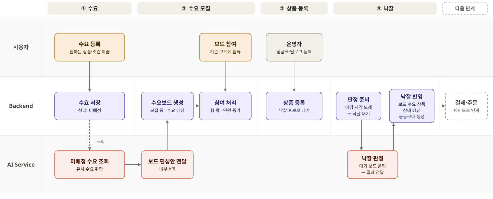
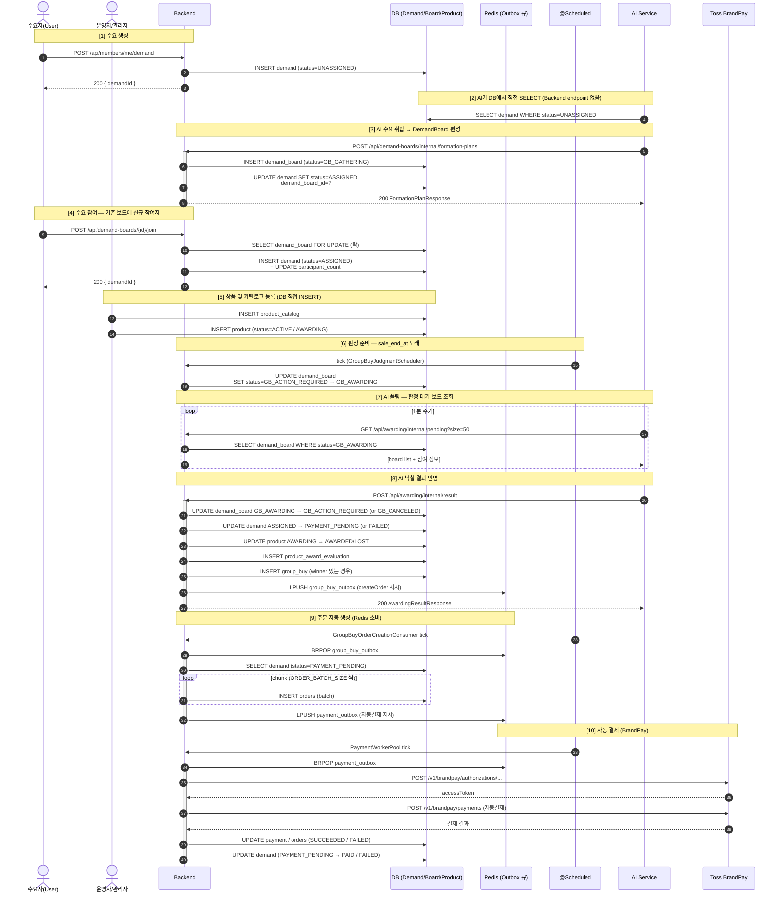
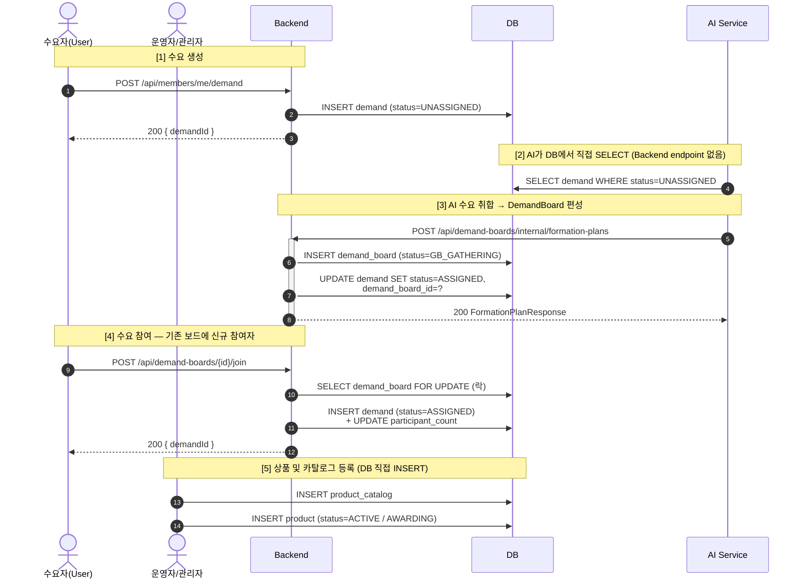
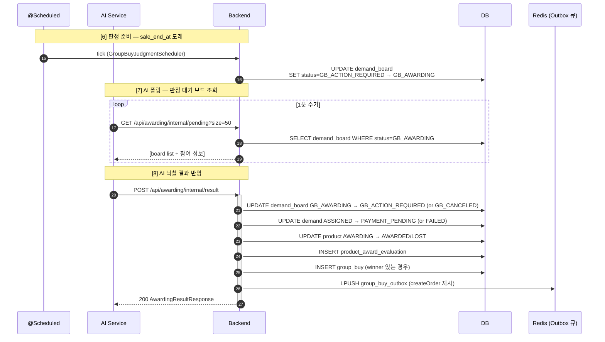
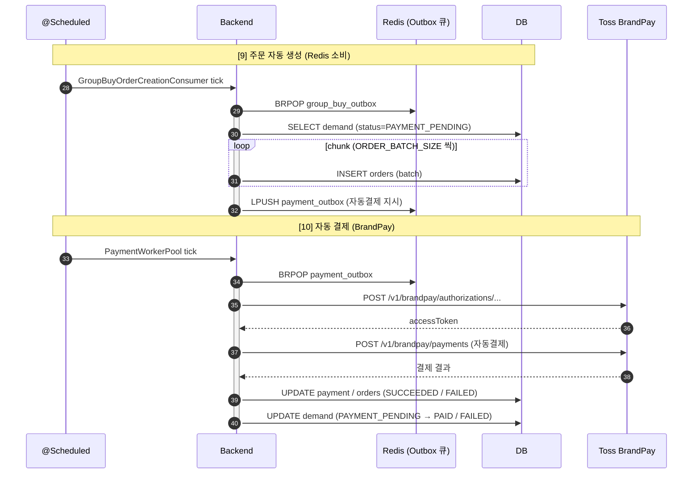

# 🧭 주요 처리 흐름 다이어그램

### "수요 등록 → 공동구매 편성 → 낙찰 → 주문 자동 생성 → 자동 결제"

**MoongCheap 백엔드의 전 과정 시퀀스**

 

## 📌 Intro

MoongCheap 백엔드가 수요 접수부터 자동결제까지를 어떻게 이어 붙이는지를 **4개의 시퀀스 다이어그램**으로 정리합니다.

- 각 다이어그램은 [`docs/images/`](images/) 하위 `.mmd` 원본에서 발췌한 것입니다.
- 번호(`autonumber`)는 전체 시퀀스(1~30+)에서의 위치를 뜻합니다. 세부 흐름 다이어그램의 번호는 **전체 시퀀스에서의 연속성**을 유지합니다.
- 상세 설계·장애 처리 근거는 각 다이어그램 아래 "관련 문서"에서 확인할 수 있습니다.

 

## 1️⃣ 전체 흐름 한눈에

수요자가 수요를 올린 뒤 공동구매가 결제까지 성사되는 전 과정을 한 장으로 압축한 다이어그램입니다.

> **관련 문서** · [시스템 아키텍처](architecture/system-architecture.md) · [AI 낙찰 플로우](domain/ai-awarding-flow.md)

 

## 2️⃣ 수요 생성과 보드 편성 (수요자 ↔ AI)

수요자가 수요를 등록하면 AI가 DB를 직접 조회해 보드를 편성하고, 이후 신규 참여자가 같은 보드에 합류하는 흐름입니다.

> **관련 문서** · [수요 쿼리/인덱스 설계](domain/demand-board-query-index.md) · [수요 만료 배치](domain/demand-expire-batch.md)

 

## 3️⃣ 낙찰 평가 (스케줄러 → AI → Outbox)

마감 시각에 보드 상태를 `GB_AWARDING`으로 전환한 뒤, AI가 결과를 전달하면 백엔드가 상태를 반영하고 **주문 생성 이벤트를 Redis 큐에 올립니다**.

> **관련 문서** · [마감·공동구매 판정 버그 리포트](troubleshooting/deadline-and-judgment-bug-report.md) · [AI 낙찰 플로우](domain/ai-awarding-flow.md)

 

## 4️⃣ 주문 자동 생성과 자동 결제 (Redis Consumer → Toss)

Outbox가 Redis 큐로 전달되면 전용 소비자가 주문 생성과 결제 호출을 담당합니다. **외부 I/O는 모두 트랜잭션 밖에서** 수행합니다.

> **관련 문서** · [Redis 결제 큐 설계](brandpay/brandpay-redis-sorted-set-design.md) · [주문 배송비 수정](troubleshooting/order-delivery-fee-fix.md) · [BrandPay 프런트엔드 연동 가이드](brandpay/brandpay-frontend-integration-guide.md)

 

**← [프로젝트 홈으로](../README.md)**

